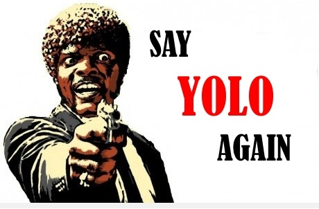

 :kr: 다크넷(darknet): C로 작성한 신경망 공개소스  

출처: https://pjreddie.com/darknet

| [다크넷](../README.md) | [설치](../1_SeolChi/SeolChi.md) | [욜로](../2_YOLO/yolo.md) | [이미지넷분류](../3_ImageNet_BunRyu/BunRyu.md) | [악몽](../4_AkMong/AkMong.md) | [재사용신경망](../5_RNN/rnn.md) | [다크고](../6_DarkGo/DarkGo.md) | [꼬맹이망](../7_GgoMaengIi/GgoMaengIi.md) | [분류기벼림](../8_SuRyeon/SuRyeon.md) | [사용방법](../11_SaYongBeob/SaYongBeob_Yolo-v3.md) |  
| --- | --- | --- | --- | --- | --- | --- | --- | --- | --- |  

<a name="욜로"></a>
<p align="center"></p>  

## 2. 욜로: 실시간 개체 검출(YOLO: Real-Time Object Detection)

```
상황공통개체(COCO: Common Object in COntext)
```

욜로는(YOLO, 너는 오직 한번만 본다) 최첨단 기술이다, 실시간 개체 검출 시스템. 타이탄 X에서 30 FPS로 이미지를 처리한다 그리고 COCO에 대해서 57.9%의 mAP 평가편차(test-dev)를 가진다.

[](https://www.youtube.com/watch?v=MPU2HistivI)

### 1) 다른 검출기와 비교

욜로v3는 매우 빠르고 정확하다. 0.5 교차겹침결합(IOU: Intersection Over Union)으로 측정한 mAP 에서 욜로v3는 초점손실은 동등하다 하지만 약 4배 빠르다. 게다가, 모형의 크기를 변경하는것 만으로 속도와 정확성간의 균형을 쉽게 이룰수 있다, 재벼림은 필요없다!

<p align="center"></p>  

### 2) 상황공통개체(COCO) 자료집합에서 성능

| 모형(Model)     | 벼림(Train) | 평가 | mAP | FLOPS | FPS | Cfg | Weights |  
| ---            | ----       | ---  | --- | ---:  | ---: | --- | ---     |  
| SSD300            | COCO 벼림값 | 평가-dev | 41.2 | - | 46 | - | [link](https://arxiv.org/abs/1512.02325) |  
| SSD500            | COCO 벼림값 | 평가-dev | 46.5 | - | 19 | - | [link](https://arxiv.org/abs/1512.02325) |  
| YOLOv2 608x608    | COCO 벼림값 | 평가-dev | 48.1 | 62.94 Bn | 40 | [cfg](https://github.com/pjreddie/darknet/blob/master/cfg/yolov2.cfg) | [weights](https://pjreddie.com/media/files/yolov2.weights) |  
| Tiny YOLO         | COCO 벼림값 | 평가-dev | 23.7 | 5.41 Bn | 207 | [cfg](https://github.com/pjreddie/darknet/blob/master/cfg/yolov2-tiny.cfg) | [weights](https://pjreddie.com/media/files/yolov2-tiny.weights) |  
| | | | | | | | |  
| SSD321            | COCO 벼림값 | 평가-dev | 45.4 | - | 16 | - | [link](https://arxiv.org/abs/1701.06659) |  
| DSSD321           | COCO 벼림값 | 평가-dev | 46.1 | - | 12 | - | [link](https://arxiv.org/abs/1701.06659) |  
| R-FCN             | COCO 벼림값 | 평가-dev | 51.9 | - | 12 | - | [link](https://arxiv.org/abs/1605.06409) |  
| SSD513            | COCO 벼림값 | 평가-dev | 50.4 | - | 8 | - | [link](https://arxiv.org/abs/1701.06659) |  
| DSSD513           | COCO 벼림값 | 평가-dev | 53.3 | - | 6 | - | [link](https://arxiv.org/abs/1701.06659) |  
| FPN FRCN          | COCO 벼림값 | 평가-dev | 59.1 | - | 6 | - | [link](https://arxiv.org/abs/1612.031449) |  
| Retinanet-50-500  | COCO 벼림값 | 평가-dev | 50.9 | - | 14 | - | [link]() |  
| Retinanet-101-500 | COCO 벼림값 | 평가-dev | 53.1 | - | 11 | - | [link]() |  
| Retinanet-101-800 | COCO 벼림값 | 평가-dev | 57.5 | - | 5 | - | [link]() |  
| YOLOv3-320        | COCO 벼림값 | 평가-dev | 51.5 | 38.97 Bn | 45 | [cfg](https://github.com/pjreddie/darknet/blob/master/cfg/yolov3.cfg) | [weights](https://pjreddie.com/media/files/yolov3.weights) |  
| YOLOv3-416        | COCO 벼림값 | 평가-dev | 55.3 | 65.86 Bn | 35 | [cfg](https://github.com/pjreddie/darknet/blob/master/cfg/yolov3.cfg) | [weights](https://pjreddie.com/media/files/yolov3.weights)  
| YOLOv3-608        | COCO 벼림값 | 평가-dev | 57.9 | 140.69 Bn | 20 | [cfg](https://github.com/pjreddie/darknet/blob/master/cfg/yolov3.cfg) | [weights](https://pjreddie.com/media/files/yolov3.weights) |  
| YOLOv3-Tiny       | COCO 벼림값 | 평가-dev | 33.1 | 5.56 Bn | 220 | [cfg](https://github.com/pjreddie/darknet/blob/master/cfg/yolov3-tiny.cfg) | [weights](https://pjreddie.com/media/files/yolov3-tiny.weights) |  

```
mAP : 평균정밀도 평균(Mean Average Precision)
Bn : 십억(Billion), 백만(Million)
cfg : 신경망 구성정보
Weights : 신경망 가중값
```


### 3) 이것은 어떻게 동작하는가.

이전 검출 시스템은 검출을 수행하기 위해 분류기 또는 유도기를 용도에 맞게 변경한다. 그것은 위치와 눈금을 여러개로 이미지에 적용한다. 이미지영역의 점수가 높으면 검출로 간주한다.

우리는 완전히 다른 접근방식을 사용한다. 우리는 전체이미지에 단일 신경망을 적용한다. 이 망은 이미지를 여러 영역으로 나눈다 그리고 경계상자와 각 영역에 대한 확률을 예측한다. 이러한 경계상자는 예측된 확률로 가중된 것이다.  

<p align="center"></p>  

우리의 모델은 분류기기반 시스템에 비해 몇가지 장점을 가진다. 평가시 이미지전체 를 확인한다 그래서 이것의 예측은 이미지에서 전체맥락으로 된 정보이다. 이것은 또한 하나의 이미지에 수천개가 필요한 [R-CNN](https://github.com/rbgirshick/rcnn) 과 달리 하나의 망으로 평가하여 예측한다. 이것은 극도로 빠르게 한다, R-CNN보다 1000배 더 빠르다 그리고 [Fast R-CNN](https://github.com/rbgirshick/fast-rcnn) 보다 100배 빠르다.  전체 시스템에 대한 자세한 내용은 우리의 [논문](https://arxiv.org/abs/1612.08242) 을 봐라.

#### 1-1) 버전 3에서 새로운것은 무엇인가?

YOLOv3은 벼림과 성능향상을 개선하기 위하여 몇가지 묘책을 사용한다, 포함: 다중축척 예측, 더좋은 중추 분류기, 그 외. 전체 내용은 우리 [논문](https://arxiv.org/abs/1612.08242)에 있다.!

### 4) 미리벼림된 모델을 사용하여 검출

이 게시물은 미리벼림된 모델을 사용한 욜로시스템으로 개체를 검출하는 방법을 안내한다. 만약 아직 다크넷이 설치되지 않았다면, 먼저 설치해야 한다. 아니면 전부 읽는 대신에 그냥 [실행해라](#그냥-실행):

```bash
git clone https://github.com/pjreddie/darknet
cd darknet
make
```

쉽다!

당신은 `cfg/` 하위디렉토리에 욜로에 대한 설정파일을 이미 가지고 있다. 당신은 미리벼림된 가중값파일을 [여기(237MB)](https://pjreddie.com/media/files/yolov3.weights)에서 내려받아야 한다. 아니면 그냥 실행해라:

```bash
wget https://pjreddie.com/media/files/yolov3.weights
```

그런다음 검출기를 실행하라!

```bash
./darknet detect cfg/yolov3.cfg yolov3.weights data/dog.jpg
```

당신은 이것과 비슷한 몇개의 출력을 볼 것이다.
```bash
layer     filters    size              input                output
    0 conv     32  3 x 3 / 1   416 x 416 x   3   ->   416 x 416 x  32  0.299 BFLOPs
    1 conv     64  3 x 3 / 2   416 x 416 x  32   ->   208 x 208 x  64  1.595 BFLOPs
    .......
  105 conv    255  1 x 1 / 1    52 x  52 x 256   ->    52 x  52 x 255  0.353 BFLOPs
  106 detection
truth_thresh: Using default '1.000000'
Loading weights from yolov3.weights...Done!
data/dog.jpg: Predicted in 0.029329 seconds.
dog: 99%
truck: 93%
bicycle: 99%
```
<p align="center"></p>  

다크넷은 출력한다 검출된 개체, 신뢰도, 그리고 찾는데 걸린 시간. 우리는 **OpenCV** 로 컴파일하지 않았다 그래서 검출을 직접 표시할 수 없다. 대신에, 예측을 `predictions.png` 로 저장한다. 당신은 검출된 개체를 보기 위하여 그 파일을 열 수 있다. 우리는 CPU에서 다크넷을 사용하기 때문에 이미지당 6-12초 걸린다. 만약 GPU 버전을 사용한다면 훨씬 더 빠를 것이다.

나는 당신이 시도하는 경우에 필요하다는 생각이 들어 몇 가지 예시 이미지를 포함했다. `data/eagle.jpg`, `data/dog.jpg`, `data/person.jpg`, 또는 `data/horses.jpg` 를 시도해라!

**검출(detect)** 명령은 명령의 일반 버전을 더 줄인것에 대한 줄임말이다. 이것은 다음 명령과 동일하다:

```bash
./darknet detector test cfg/coco.data cfg/yolo.cfg yolo.weights data/dog.jpg
```

하나의 이미지에서 검출을 실행하려는 경우 이것을 알 필요는 없다 하지만 웹캠에서 실행되는 것과 같은 다른 것을 하고 싶다면 아는것이 유용하다([나중에](https://pjreddie.com/darknet/yolo/#demo) 보게 될 것이다).

#### 4-1) 다중 이미지(Multiple Images)

명령줄에 이미지를 제공하는 대신에, 한번에 여러개의 이미지를 시도해 볼 수 있다. 대신에 설정과 가중값 탑재가 완료되면 당신은 프롬프트를 볼 수 있다:

```bash
./darknet detect cfg/yolo.cfg yolo.weights
layer     filters    size              input                output
    0 conv     32  3 x 3 / 1   416 x 416 x   3   ->   416 x 416 x  32
    1 max          2 x 2 / 2   416 x 416 x  32   ->   208 x 208 x  32
    .......
   29 conv    425  1 x 1 / 1    13 x  13 x1024   ->    13 x  13 x 425
   30 detection
Loading weights from yolo.weights ...Done!
Enter Image Path:
```

`data/horses.jpg` 처럼 가지고 있는 이미지 경로를 입력하여 이미지에 대한 상자를 예측한다.

<p align="center"></p>  

일단 완료되면 다른 이미지를 시도하기 위하여 다른 경로를 물어볼 것이다. 끝나면 Ctrl-C 를 사용하여 프로그램을 종료한다.

#### 4-2) 검출문턱 변경(Changing The Detection Threshold)

기본적으로, 욜로는 0.25 이상 확신의 검출된 개체만 표시한다. `욜로(yolo)` 명령에 `-thresh <값>` 표시정보를 전달하여 이것을 변경할 수 있다. 예를 들면, 모든 검출을 표시하기 위하여 `0`으로 문턱을 설정할 수 있다:

```bash
./darknet detect cfg/yolov3.cfg yolov3.weights data/dog.jpg -thresh 0
```

생산된 것:
<p align="center"></p>  

이것은 분명하게 그다지 아주 유용하지 않다 하지만 모형에서 문턱값을 얻어서 어떤것을 제어하기 위한 다른 값으로 설정할 수 있다.

#### 4-3) 꼬맹이 욜로v3(Tiny YOLOv3)

 우리는 제한된 환경에 적합한 아주 작은 모형을 가지고 있다, `욜로v3-꼬맹이(yolov3-tiny)`. 이 모형을 사용하려면, 먼저 가중값을 내려받는다:

```bash
wget https://pjreddie.com/media/files/yolov3-tiny.weights
```

 그런다음 꼬맹이 설정파일과 가중값으로 검출기를 실행한다:

```bash
./darknet detect cfg/yolov3-tiny.cfg yolov3-tiny.weights data/dog.jpg
```

### 5) 웹캠으로 실시간 검출(Real-Time Detection on a Webcam)

평가자료로 욜로를 실행하는 것은 그다지 흥미롭지 않다 결과를 볼 수 없다면. 이미지뭉치로 실행하는 대신 웹캠에서 입력으로 실행해보자!

이 실증(데모)을 실행하기 위해서는 [쿠다와 OpenCV로 다크넷](https://pjreddie.com/darknet/install/#cuda)을 컴파일할 필요가 있다. 그런다음 명령을 실행하라:

```bash
./darknet detector demo cfg/coco.data cfg/yolov3.cfg yolov3.weights
```

욜로는 현재 FPS와 예상된 분류뿐만 아니라 이 위에 경계상자가 그려진 이미지를 표시할 것이다.

OpenCV가 연결할 수 있는 컴퓨터에 웹캠이 연결되어 있어야한다 그렇지않으면 작동하지 않는다. 여러개의 웹캠이 연결되어 있고 사용할 웹캠을 선택하려면 `-c <번호>` 표시정보를 사용하여 선택할 수 있다(OpenCV는 기본적으로 웹캠 `0`을 사용한다).

또한 동영상파일로 실행할 수 있다 OpenCV가 동영상을 읽을 수 있다면:

```bash
./darknet detector demo cfg/coco.data cfg/yolov3.cfg yolov3.weights <video file>
```

이것은 위의 유튜브동영상을 만든 방법이다.

### 6) 시각개체분류(VOC)로 욜로 벼림(Training YOLO on VOC)

```bash
VOC: 시각개체분류(Visual Object Classes)
```

처음부터 욜로(YOLO)를 벼림할 수 있다 다른 벼림 체계, 잠정참여, 또는 자료집합으로 놀고싶다면. 사물 시각개체분류(Pascal VOC) 자료집합으로 작업하는 방법이 여기에 있다.

#### 6-1) 사물 시각개체분류 자료를 가져온다(Get The Pascal VOC Data)

 욜로(YOLO)를 벼림시키기 위해서는 2007년 부터 2012년 까지 모든자료가 필요하다. 자료 연결은 [여기](https://pjreddie.com/projects/pascal-voc-dataset-mirror/)에서 찾을수 있다. 모든 자료를 얻으려면, 모든것을 저장할 디렉토리를 만든다 그리고 그 디렉토리에서 실행한다:

```bash
wget https://pjreddie.com/media/files/VOCtrainval_11-May-2012.tar
wget https://pjreddie.com/media/files/VOCtrainval_06-Nov-2007.tar
wget https://pjreddie.com/media/files/VOCtest_06-Nov-2007.tar
tar xf VOCtrainval_11-May-2012.tar
tar xf VOCtrainval_06-Nov-2007.tar
tar xf VOCtest_06-Nov-2007.tar
```

이제 모든 시각개체분류(VOC) 벼림자료에 `VOCdevkit/`가 포함된 하위디렉토리가 생긴다.

<a name="시각개체분류-딱지-생성"></a>
#### 6-2) 시각개체분류에 대한 딱지 생성(Generate Labels for VOC)

 이제 다크넷이 사용하는 딱지 파일을 생성해야 한다. 다크넷은 각 이미지에 대한 `.txt` 파일을 원한다 이미지에서 각 개체의 신뢰영역에 대한 하나의 행으로 그 양식은 다음과 같다:

```bash
<개체-분류> <x> <y> <너비> <높이>
```

 여기에서 `x`, `y`, `너비`, 그리고 `높이`는 이미지의 너비와 높이에 연관된 것이다. 이러한 파일을 생성하기 위하여 다크넷의 `scripts/` 디렉토리에서 `voc_label.py` 스크립트를 실행해야한다. 그냥 다시 내려받기를 하자 왜냐하면 우리는 게으르기 때문이다.

```bash
wget https://pjreddie.com/media/files/voc_label.py
python voc_label.py
```

 몇 분 후에, 이 스크립트는 모든 필수파일을 생성한다. `VOCdevkit/VOC2007/labels/` 과 `VOCdevkit/VOC2012/labels/` 에 가장 많은 딱지파일을 생성한다. 디렉토리에서 반드시 봐야한다:

```bash
ls
2007_test.txt   VOCdevkit
2007_train.txt  voc_label.py
2007_val.txt    VOCtest_06-Nov-2007.tar
2012_train.txt  VOCtrainval_06-Nov-2007.tar
2012_val.txt    VOCtrainval_11-May-2012.tar
```

 `2007_train.txt` 같은 문자파일은 연도와 이미지집합에 대한 이미지파일의 목록이 나열된것이다.  다크넷은 벼림을 원하는 이미지 전체와 문자로된 하나의 파일이 필요하다. 이 본보기에서, 2007년 평가집합을 제외하고 모든것을 벼림시키자 그런 다음 우리의 모형을 평가할 수 있다. 실행한다:

```bash
cat 2007_train.txt 2007_val.txt 2012_*.txt > train.txt
```

 이제 가지고있는 2007년 trainval와 2012년 trainval의 전부를 하나의 큰 목록 집합한다. 이것이 자료를 설정하기위한 전부이다!

#### 6-3) 사물 자료를 위해 Cfg를 수정한다(Modify Cfg for Pascal Data)

이제 다크넷 디렉토리로 가라. 자료를 지시하기 위하여 `cfg/voc.data` 구성파일을 변경해야 한다:

```bash
  1 classes= 20
  2 train  = <path-to-voc>/train.txt
  3 valid  = <path-to-voc>2007_test.txt
  4 names = data/voc.names
  5 backup = backup
```

`<path-to-voc>`를 VOC 자료를 저장할 디렉토리로 반드시 대체해야 한다.

#### 6-4) 미리벼림된 나선 가중값 내려받기(Download Pretrained Convolutional Weights)

벼림을 위하여 이미지넷에서 미리벼림된 나선 가중값을 사용한다. [darknet53](https://pjreddie.com/darknet/imagenet/#darknet53)모형의 가중값을 사용한다. 나선층에 대한 가중값은 [여기(76MB)](https://pjreddie.com/media/files/darknet53.conv.74)에서 바로 내려받기할 수 있다.

```bash
wget https://pjreddie.com/media/files/darknet53.conv.74
```

#### 6-5) 모형 벼림(Train The Model)

이제 벼림할 수 있다! 명령을 실행한다:

```bash
./darknet detector train cfg/voc.data cfg/yolov3-voc.cfg darknet53.conv.74
```

### 7) COCO에 대한 욜로 벼림(Training YOLO on COCO)

```bash
CoCo: 상황공통개체(Common Objects in Context, 상황에서 공통 개체)
```

처음부터 욜로(YOLO)를 벼림할 수 있다 다른 벼림 체계, 잠정참여, 또는 자료집합으로 놀고싶다면. [:kr:COCO 자료집합](../10_JaRyoJibHab/COCO.md)[(영문)](http://mscoco.org/dataset/#overview)으로 작업하는 방법이 여기에 있다.

#### 7-1) 코코(COCO) 자료를 가져온다(Get The COCO Data)

욜로를 벼림시키기 위해서는 COCO의 모든 자료와 딱지가 필요하다. `scripts/get_coco_dataset.sh` 스크립트가 이것을 수행한다. COCO 자료를 넣을 위치를 파악한다 그리고 내려받기한다, 예를 들면:

```bash
cp scripts/get_coco_dataset.sh data
cd data
bash get_coco_dataset.sh
```

이제 다크넷을 위하여 모든 자료와 딱지를 반드시 가지고 있어야 한다.

#### 7-2) 코코(COCO)에 대한 cfg를 수정한다(Modify cfg for COCO)

이제 다크넷 디렉토리로 가라. 자료를 지시가히 위하여 `cfg/coco.data` 구성파일을 변경해야 한다:

```bash
  1 classes= 80
  2 train  = <path-to-coco>/trainvalno5k.txt
  3 valid  = <path-to-coco>/5k.txt
  4 names = data/coco.names
  5 backup = backup
```

`<path-to-coco>` 를 COCO 자료를 저장한 디렉토리로 반드시 대체해야 한다.

또한 평가 대신에 벼림을 위하여 모형 cfg를 반드시 수정해야 한다. `cfg/yolo.cfg`는 다음과 같아야 한다:

```bash
[net]
# Testing
# batch=1
# subdivisions=1
# Training
batch=64
subdivisions=8
....
```

#### 7-3) 모형 벼림(Train The Model)

이제 벼림할 수 있다! 명령을 실행한다:

```bash
./darknet detector train cfg/coco.data cfg/yolov3.cfg darknet53.conv.74
```

여러개의 GPU를 사용하려면 다음을 실행한다:

```bash
./darknet detector train cfg/coco.data cfg/yolov3.cfg darknet53.conv.74 -gpus 0,1,2,3
```

만약 벼림을 중지하고 확인지점에서 다시 시작하려면 다음을 수행하라:

```bash
./darknet detector train cfg/coco.data cfg/yolov3.cfg backup/yolov3.backup -gpus 0,1,2,3
```

### 8) 옛 욜로 유적은 어떻게 되었나(What Happened to the Old YOLO Site)?

욜로 판2를 사용한다면 여전히 여기에서 인용을 찾을 수 있다:  
[:kr:욜로v2](../2_YOLO/yolov2.md)[(영문)](https://pjreddie.com/darknet/yolov2)


욜로 판1을 사용한다면 여전히 여기에서 인용을 찾을 수 있다:  
[:kr:욜로v1](../2_YOLO/yolov1.md)[(영문)](https://pjreddie.com/darknet/yolov1)

### 8) 인용(Cite)

만약 당신의 작업에 욜로v3을 사용한다면 우리의 논문을 인용하시오!

```bash
@article{yolov3,
  title={YOLOv3: An Incremental Improvement},
  author={Redmon, Joseph and Farhadi, Ali},
  journal = {arXiv},
  year={2018}
}
```

---
