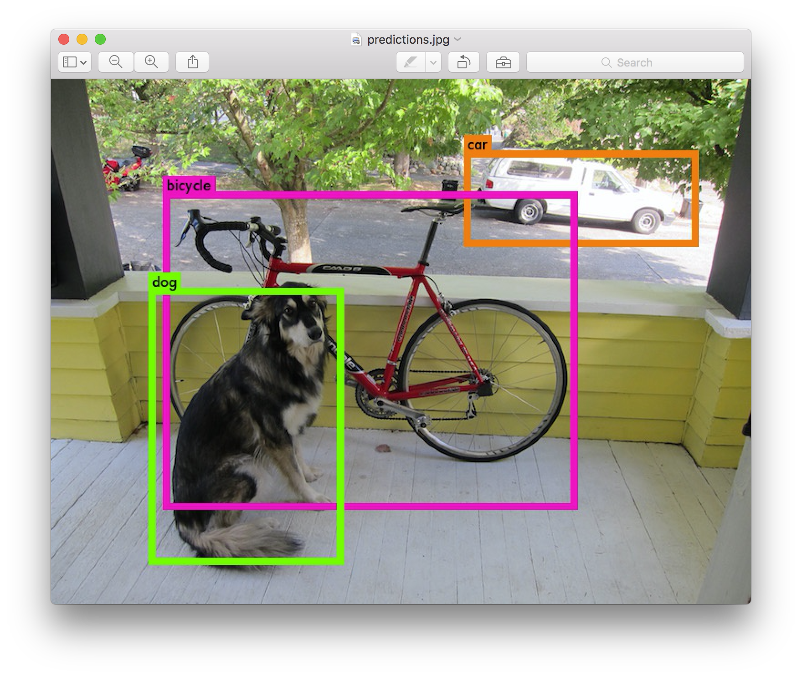
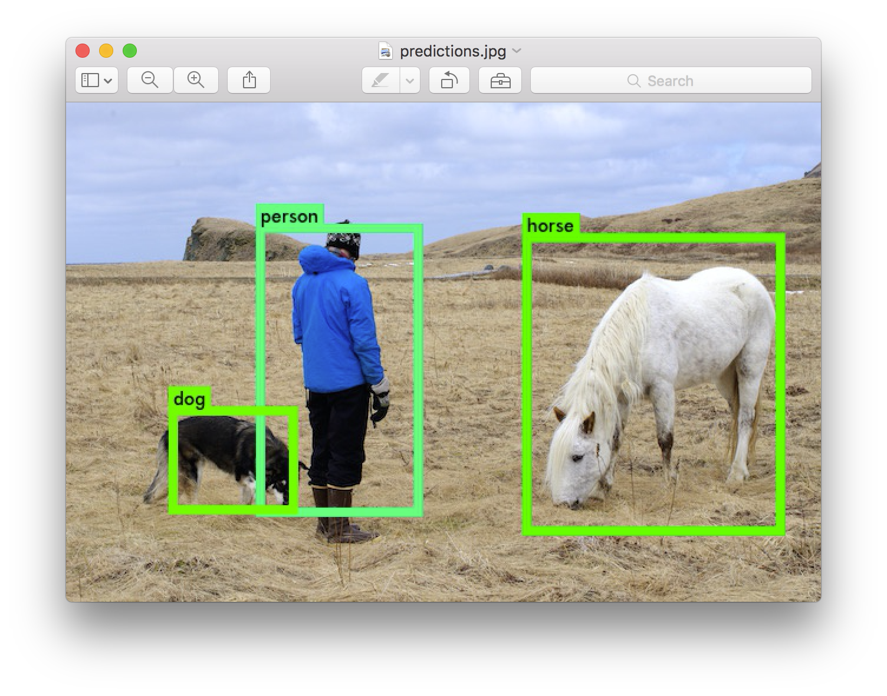
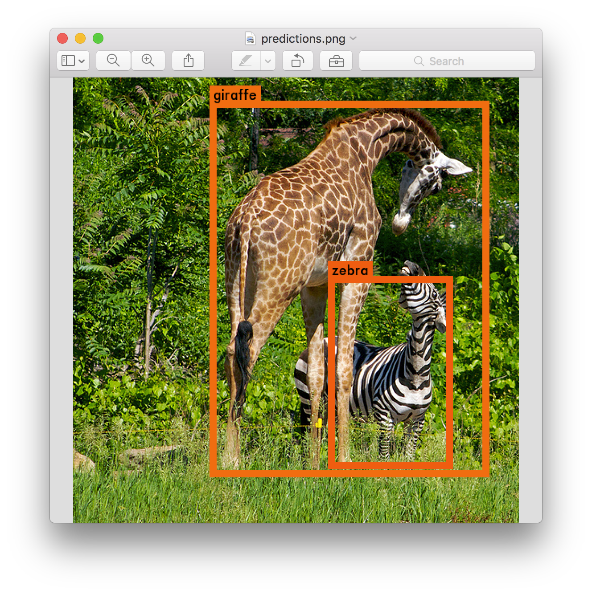

:kr: 다크넷(darknet): C로 작성한 신경망 공개소스 

출처: https://pjreddie.com/darknet/yolov1

| [다크넷](../README.md) | [설치](../1_SeolChi/SeolChi.md) | [욜로](../2_YOLO/yolo.md) | [이미지넷분류](../3_ImageNet_BunRyu/BunRyu.md) | [악몽](../4_AkMong/AkMong.md) | [재사용신경망](../5_RNN/rnn.md) | [다크고](../6_DarkGo/DarkGo.md) | [꼬맹이망](../7_GgoMaengIi/GgoMaengIi.md) | [분류기벼림](../8_SuRyeon/SuRyeon.md) | [사용방법](./SaYongBeob_Yolo-v3.md) |  
| --- | --- | --- | --- | --- | --- | --- | --- | --- | --- |  

<a name="욜로v1"></a>
<p align="center"></p>  

## 2. 욜로(YOLO): 실시간 개체 검출(Real-Time Object Detection)

### 갱신: 욜로v2를 완료함

당신은 대신에 이것을 원할 것이다: [:kr:욜로](../2_YOLO/yolo.md)[(영문)](http://pjreddie.com/yolo)

나는 기록을 목적으로 이것을 남겨둔다... 또는 무엇인가를 위해.

[](https://www.youtube.com/watch?v=K9a6mGNmhbc)

```
사물 시각개체분류(Pascal VOC: PASCAL Visual Object Classes)
```

욜로(YOLO, 너는 오직 한번만 본다)는 사물 시각개체분류 2012(Pascal VOC 2012) 자료집합에서 개체를 검출하기 위한 몸통(시스템)이다. 이것은 20 사물 개체를 검출할수 있다:

- 사람
- 새, 고양이, 소, 개, 말, 양
- 비행기, 자전거, 배, 버스, 자동차, 오토바이, 기차
- 병, 의자, 식탁, 꽃병, 소파, 티브이/모니터

욜로는 Santosh, Ross, 그리고 Ali 와 공동으로 작업했다, 그리고 이것은 우리의 논문에 자세히 설명하였다.

### 1. 작동 원리

모든 이전 검출 몸통(시스템)은 검출을 수행하기 위해 분류기 또는 유도기를 용도에 맞게 변경한다. 그것은 위치와 눈금을 여러개로 이미지에 적용한다. 이미지영역의 점수가 높으면 검출로 간주한다.

우리는 완전히 다른 접근방식을 사용한다. 우리는 전체이미지에 단일 신경망을 적용한다. 이 망은 이미지를 여러 영역으로 나눈다 그리고 경계상자와 각 영역에 대한 확률을 예측한다. 이러한 경계상자는 예측된 확률로 가중된 것이다.

<p align="center"></p>  

끝으로, 우리는 높은 검출점수만 보기 위하여 임의의 값로 검출 문턱으로 할수 있다:

<p align="center"></p>  

우리의 모델은 분류기기반 시스템에 비해 몇가지 장점을 가진다. 평가시 이미지전체 를 확인한다 그래서 이것의 예측은 이미지에서 전체맥락으로 된 정보이다. 이것은 또한 하나의 이미지에 수천개가 필요한 R-CNN 과 달리 하나의 망으로 평가하여 예측한다. 이것은 극도로 빠르게 한다, [R-CNN](https://github.com/rbgirshick/rcnn)보다 1000배 더 빠르다 그리고 [Fast R-CNN](https://github.com/rbgirshick/fast-rcnn) 보다 100배 빠르다. 전체 시스템에 대한 자세한 내용은 우리의 [논문](http://arxiv.org/abs/1506.02640) 을 봐라.

### 2. 미리벼림된 모형을 사용하여 검출

 이 게시물은 미리벼림된 모형을 사용한 욜로 몸통(시스템)으로 개체를 검출하는 방법을 안내한다. 만약 아직 다크넷이 설치되지 않았다면, [:kr:먼저 설치](../1_SeolChi/SeolChi.md)[(영문)](http://pjreddie.com/darknet/install/)해야 한다.

 당신은 `cfg/` 하위디렉토리에 욜로에 대한 설정파일을 이미 가지고 있다. 당신은 미리벼림된 가중값파일을 [여기(753 MB)](http://pjreddie.com/media/files/yolov1/yolov1.weights)에서 내려받아야 한다. 아니면 그냥 실행해라:  

```bash
wget http://pjreddie.com/media/files/yolov1.weights
./darknet yolo test cfg/yolov1/yolo.cfg yolov1.weights data/dog.jpg
```

 당신에게 영감을 줄 필요가있는 경우에 시도하기 위한 몇개의 본보기 이미지를 포함시켰다. `data/eagle.jpg`, `data/dog.jpg`, `data/person.jpg`, 또는 `data/horses.jpg`를 시도해 봐라! 자신의 가중값파일이 기본 디렉토리에 있다고 가정하면, 당신은 이같은 것울 볼 것이다:

```bash
./darknet yolo test cfg/yolov1/yolo.cfg yolov1.weights data/dog.jpg
0: Crop Layer: 448 x 448 -> 448 x 448 x 3 image
1: Convolutional Layer: 448 x 448 x 3 image, 64 filters -> 224 x 224 x 64 image
....
27: Connected Layer: 4096 inputs, 1225 outputs
28: Detection Layer
Loading weights from yolo.weights...Done!
data/dog.jpg: Predicted in 8.012962 seconds.
0.941620 car
0.397087 bicycle
0.220952 dog
Not compiled with OpenCV, saving to predictions.png instead
```

 다크넷은 검출한 개체를 출결한다, 그 자신감(확신), 그리고 찾는데 걸린 시간. CPU에서 다크넷을 사용하기 때문에 이미지당 약 6~12초가 소요된다. 만약 GPU판을 사용하면 훨씬 더 빠를 것이다.

 우리는 OpenCV로 다크넷을 컴파일하지 않았다. 그래서 검출을 직접 표시할 수 없다. 대신에 이것을 `predictions.png`로 저장한다. 검출된 개체를 보기위해 열수 있다:

<p align="center"></p>  

 만세!!

#### 2-1. 다중이미지

명령행에 이미지를 제공하는 대신, 연속해서 다중이미지를 시도하기 위해 비워두고 떠날수 있다. 대신 설정과 가중값 탑재가 끝나면 입력대기(입력즉시실행)를 볼수 있다:

```
./darknet yolo test cfg/yolov1/yolo.cfg yolov1.weights
0: Crop Layer: 448 x 448 -> 448 x 448 x 3 image
1: Convolutional Layer: 448 x 448 x 3 image, 64 filters -> 224 x 224 x 64 image
....
27: Connected Layer: 4096 inputs, 1225 outputs
28: Detection Layer
Loading weights from yolo.weights...Done!
Enter Image Path:
```

 그 이미지에 대한 예측상자를 가지기위해 `data/eagle.jpg`처럼 이미지경로를 입력한다. 일단 이것이 끝나면 다른이미지를 시도하기 위해 더많은 경로에 대한 입력대기(입력즉시실행)할 것이다. 일단 끝나면 프로그램 종료를 위해 *Ctrl-C* 를 사용한다.

#### 2-2. 꼬맹이 모형

 `tiny-yolo.cfg`는 [:kr:다크넷 기준망(Darknet reference network)](../3_ImageNet_BunRyu/BunRyu.md#기준망)[(영문)](http://pjreddie.com/darknet/imagenet/#reference)을 기반으로 한다. `cfg/` 하위디렉토리에 설정파일이 이미 있어야 한다. [여기(103MB)](http://pjreddie.com/media/files/yolov1/tiny-yolov1.weights)에서 미리벼림된 가중값을 내려받는다. 그런다음 모형을 실행할 수 있다!

```bash
wget http://pjreddie.com/media/files/tiny-yolo.weights
./darknet yolo test cfg/yolov1/tiny-yolo.cfg tiny-yolo.weights data/person.jpg
```

<p align="center"></p>  

꼬맹이판 욜로는 GPU 메모리의 516MB만 사용한다 그리고 타이탄엑스(Titan X)에서 150fps 이상으로 실행된다. 검출 문턱을 변경했음을 알린다. 이것은 이것은 자전거 검출이 나타날수 있도록 하기위한 것이다.

#### 2-3. 욜로모형 비교

* `yolo.cfg`는 [추출](http://pjreddie.com/darknet/imagenet/#extraction)망을 기반으로 한다. 이것은 45fps로 이미지를 처리한다, 여기는 [2007 train/val+ 2012 train/val](http://pjreddie.com/media/files/yolov1/yolov1.weights)에서 벼림된 `yolo.cfg`에 대한 가중값 파일이 있다.
* `tiny-yolo.cfg`는 훨씬 작다 그리고 [:kr:다크넷 기준망(Darknet reference network)](../3_ImageNet_BunRyu/BunRyu.md#기준망)[(영문)](http://pjreddie.com/darknet/imagenet/#reference)을 기반으로 한다. 이것은 155fps로 이미지를 처리한다, 여기는 [2007 train/val+ 2012 train/val](http://pjreddie.com/media/files/yolov1/tiny-yolov1.weights)에서 벼림된 `tiny-yolo.cfg`에 대한 가중값 파일이 있다.

#### 2-4. 검출 문턱값 변경

 기본적으로, 욜로는 0.2보다 큰 자신감(확신)의 검출된 개체만 표시한다. 욜로 명령에 `-thresh <값>` 표시정보(flag)를 전달하여 이것을 변경할 수 있다. 예를 들면, 모든 검출츨 표시하기 위하여 0으로 문턱을 설정할 수 있다:

```
./darknet yolo test cfg/yolov1/yolo.cfg yolov1.weights data/dog.jpg -thresh 0
```

생산된 것:

<p align="center"></p>  

### 3. VOC 2012 로 실시간 검출

```
시각개체분류 도전 2012(VOC 2012: Visual Object Classes challenge 2012)
```

 만약 쿠다로 컴파일하면 그것을 타자하여 입력하는것 보다 이미지를 빠르게 처리할 수 있다. 다중 이미지에서 개체검출을 효율적으로 하기 위하여 우리는 욜로의 유효한 서브루틴을 사용할 수 있다.

 먼저 자료를 가져온다 그리고 다크넷을 위한 메타데이타를 생성한다. VOC 2012 평가자료는 [여기](http://host.robots.ox.ac.uk:8080/eval/downloads/VOC2012test.tar)에서 찾을수 있다 하지만 계정이 필요하다! 일단 `2012test.tar`파일을 구하면 다음 명령을 실행할 필요가 있다:

```bash
tar xf 2012test.tar
cp VOCdevkit/VOC2012/ImageSets/Main/test.txt .
sed 's?^?'`pwd`'/VOCdevkit/VOC2012/JPEGImages/?; s?$?.jpg?' test.txt > voc.2012.test
```

 이 명령은 자료를 추출한다 그리고 평가 이미지의 전체경로 목록을 생성한다. 그런다음, 이 목록을 `darknet/data` 하위디렉토리로 이동한다:

```bash
mv voc.2012.test <path-to>/darknet/data
```

 이제 검출할 준비가 되었다! 다크넷이 쿠다로 컴파일되었는지 확인하라 그러면 아주 빨라질 것이다. 그런다음 실행하라:

```bash
./darknet yolo valid cfg/yolov1/yolo.cfg yolov1.weights
```

 당신은 날아다니기 시작하는 숫자다발의 전체를 볼 것이다. 그것은 실행으로 검출된 이미지수 이다! 나는 타이탄엑스(Titan X)에서 최종 출력으로 이것을 봤다:

```bash
....
10984
10992
Total Detection Time: 250.000000 Seconds
```

 이 VOC 2012 평가집합에는 10,991개의 이미지가 있다. 우리는 단지 250초 만에 처리했다! 그것은 초당 44프레임이다! 만약 [선택적검색(Selective Search)](http://koen.me/research/selectivesearch/)을 사용하는 경우 이미지 전체에 대한 제안영역 추출 조차도 6시간이 걸릴 것이다. 우리는 전체 검출 파이프라인을 단지 4분만에 실행햤다. 정말 멋지다.

 예측된 검출은 `results/` 하위디렉토리에 있다. 이것들은 사물 시각개체분류(Pascal VOC) [제출](http://host.robots.ox.ac.uk:8080/)을 위해 지정된 형식이다.

 만약 당신이 파스칼 도전에서 우리의 순위를 재현하는데 관심이 있다면 대신에 [이 가중값 파일(1.0GB)](http://pjreddie.com/media/files/yolo.rescore.weights)을 사용해야 한다. 이것은 약간 더좋은 mAP(평균정일도평균, Mean Average Precision) 점수를 주는 논문에서 우리가 설명한 교차겹침결합(IOU: Intersection Over Union) 예측으로 벼림되었다. 이 숫자는 완전히 일치하지는 않는다 실수로 원재 가중치 파일을 삭제했기 때문에 하지만 이것은 거의(근사하게) 같을 것이다.

### 4. 웹캠으로 실시간 검출

 평가자료에서 욜로를 실행하는 것은 그리 흥미롭지 않다 만약 결과를 볼 수 없다면. 이미지 다발로 실행하는 대신 웹캠으로 입력하여 실행해 보자! 아래는 웹캠으로 실행하는 욜로의 본보기다 이것은 유튜브 동영상을 가리킨 것이다:

[](https://www.youtube.com/watch?v=r6ZzopHEO1U)

 이 데모를 실행하기 위해 [쿠다 및 오픈씨브이로 다크넷](../1_SeolChi/SeolChi.md/#cuda)[(영문)](http://pjreddie.com/darknet/install/#cuda)을 컴파일 할 필요가 있다. 당신은 또한 [욜로 설정파일 고르기](https://pjreddie.com/darknet/yolov1/#models)가 필요핟 그리고 적당한 가중파일을 가져야 한다. 그런다음 명령을 실행하라:

``` bash
./darknet yolo demo cfg/yolov1/yolo.cfg yolov1.weights
```

 욜로는 현재 FPS와 예측된 분류뿐만 아니라 그 위에 경계상자가 그려진 이미지를 표시할 것이다.

<p align="center"></p>  

 OpenCV가 연결할수 있는 컴퓨터에 웹캠이 연결되어 있어야 한다 그렇지 않으면 작동하지 않는다. 만약 여러개의 웹캠이 연결되어 있다 그리고 원하는 하나를 선택하여 사용하기 위해 `-c <num>` 표시정보(flag)를 전달하여 고를수 있다(OpenCV는 기본적으로 웹캠 `0`을 사용한다).

### 5. YOLO + COCO

```
상황공통개체(COCO: Common Object in COntext)
```

 [상황공통개체(COCO)](http://mscoco.org/)는 80개체 범주를 가진 마이크로소프트의 거대검출 자료집합이다. 우리는 상황공통개체(COCO)로 벼림된 한쌍의 욜로 모형을 가지고 있다. 만약 처음부터 시작한다면 하나의 이미지에서 개체를 검출하기 위하여 이러한 명령을 실행할수 있다:

```bash
git clone https://github.com/pjreddie/darknet
cd darknet
make
wget http://pjreddie.com/media/files/tiny-coco.weights
./darknet coco test cfg/yolov1/tiny-coco.cfg tiny-coco.weights data/giraffe.jpg
```

 검출을 보기 위해, `predictions.png` 파일을 확인한다.

<p align="center"></p>  

 또한 욜로 모형 전체를 사용할수 있다:

```bash
wget http://pjreddie.com/media/files/yolo-coco.weights
./darknet coco test cfg/yolov1/yolo-coco.cfg yolo-coco.weights data/giraffe.jpg
```

### 6. 욜로 벼림

 욜로를 처음부터 벼림할수 있다 만약 다른 벼림 체제, 잠정참여(hyper-parameters), 또는 자료집합으로 놀고싶다면. 여기에 사물 시각개체분류(Pascal VOC) 자료집합에서 작업하는 방법이 있다.

#### 6-1. 사물 시각개체분류(Pascal VOC) 자료 가져오기

 욜로를 벼림하기 위하여 2007년 부터 2012년 까지의 시각개체분류(VOC) 자료가 필요하다. 자료에 자료 연결은 [여기](http://pjreddie.com/projects/pascal-voc-dataset-mirror/)에서 찾을수 있다. 모든 자료를 가져오기 위하여, 모든것을 저장할 디렉토리를 만든다 그리고 그 디렉토리에서 실행:

```bash
wget https://pjreddie.com/media/files/VOCtrainval_11-May-2012.tar
wget https://pjreddie.com/media/files/VOCtrainval_06-Nov-2007.tar
wget https://pjreddie.com/media/files/VOCtest_06-Nov-2007.tar
tar xf VOCtrainval_11-May-2012.tar
tar xf VOCtrainval_06-Nov-2007.tar
tar xf VOCtest_06-Nov-2007.tar
```

 이제 모든 시각개체분류(VOC) 자료가 포함된 `VOCdevkit/` 하위디렉토리가 생긴다.

#### 6-2. 시각개체분류(VOC)를 위한 딱지 생성

 이제 다크넷이 사용하는 딱지 파일을 생성해야 한다. 다크넷은 각 이미지에 대한 `.txt` 파일을 원한다 이미지에서 각 개체의 신뢰영역에 대한 하나의 행으로 그 양식은 다음과 같다:

```bash
<개체-부류> <x> <y> <너비> <높이>
```

 여기에서 `x`, `y`, `너비`, 그리고 `높이`는 이미지의 너비와 높이에 연관된 것이다. 이러한 파일을 생성하기 위하여 다크넷의 `scripts/` 디렉토리에서 `voc_label.py` 스크립트를 실행해야한다. 그냥 다시 내려받기를 하자 왜냐하면 우리는 게으르기 때문이다.

```bash
wget https://pjreddie.com/media/files/voc_label.py
python voc_label.py
```

 몇 분 후에, 이 스크립트는 모든 필수파일을 생성한다. `VOCdevkit/VOC2007/labels/` 과 `VOCdevkit/VOC2012/labels/` 에 가장 많은 딱지파일을 생성한다. 디렉토리에서 반드시 봐야한다:

```bash
ls
2007_test.txt   VOCdevkit
2007_train.txt  voc_label.py
2007_val.txt    VOCtest_06-Nov-2007.tar
2012_train.txt  VOCtrainval_06-Nov-2007.tar
2012_val.txt    VOCtrainval_11-May-2012.tar
```

 `2007_train.txt` 같은 문자파일은 연도와 이미지집합에 대한 이미지파일의 목록이 나열된것이다.  다크넷은 벼림을 원하는 이미지 전체와 문자로된 하나의 파일이 필요하다. 이 본보기에서, 2007년 평가집합을 제외하고 모든것을 벼림시키자 그런 다음 우리의 모형을 평가할 수 있다. 실행한다:

```bash
cat 2007_* 2012_train.txt > train.txt
```

 이제 가지고있는 2007년 trainval와 2012년 trainval의 전부를 하나의 큰 목록 집합한다. 이것이 자료를 설정하기위한 전부이다!

#### 6-3. 다크넷에서 사물(Pascal) 자료를 가리킨다

 이제 다크넷 디렉토리로 이동하라. 우리는 자신의 VOC 자료 사본을 가리키기 위해 `욜로`의 `벼림` 하위디렉토리를 변경해야 한다. `src/yolo.c`의, 18행과 19행을 수정하라:

```bash
18     char *train_images = "/home/pjreddie/data/voc/test/train.txt";
19     char *backup_directory = "/home/pjreddie/backup/";
```

 `train_images`는 자신이 방금 생성한 `train.txt` 파일을 가리켜야 한다 그리고 `backup_directory`는 벼림중에 가중값 예비파일을 저장할 디렉토리를 가리켜야 한다. 일단 행을 수정했다면, 다크넷을 다시 만든다.

#### 6-4. 미리벼림된 나선 가중값 내려받기

 벼림을 위해 우리는 이미지넷으로 미리벼림된 나선 가중값을 사용한다. 우리는 [:kr:추출모형(Extraction)](../3_ImageNet_BunRyu/BunRyu.md#추출망)[(영문)](http://pjreddie.com/darknet/imagenet/#extraction)의 가중값을 사용한다. 나선 층에 대한 가중값은 [여기(86MB)](http://pjreddie.com/media/files/extraction.conv.weights)에서 내려받을수 있다.

 만약 꼬맹이 모형을 벼림하고 싶다면 [여기(25MB)](http://pjreddie.com/media/files/darknet.conv.weights)의 다크넷 기준망 나선 가중값을 사용해야 한다.

 만약 자신의 미리벼림된 가중값을 생성하기를 원한다면, 미리벼림된 [:kr:추출모형(Extraction model)](../3_ImageNet_BunRyu/BunRyu.md#추출망)[(영문)](http://pjreddie.com/darknet/imagenet/#extraction)을 내려받는다 그리고 다음 명령을 실행하라:

```bash
./darknet partial cfg/extraction.cfg extraction.weights extraction.conv.weights 24
```

 하지만 만약 그냥 가중값파일을 내려받으면 그것이 더 쉬운 방법이다.

#### 6-5. 벼림!!

 마침내 벼림을 시작할 준비가 되었다. 실행하라:

```bash
./darknet yolo train cfg/yolov1/yolo.train.cfg extraction.conv.weights
```

 이것은 숫자와 결과물을 뱉어내기 시작해야 한다.

#### 6-6. 벼림 확인지점

 매 128,000 이미지 이후 다크넷은 `src/yolo.c`에서 자신이 지정한 디렉토리에 벼림 확인지점을 저장할 것이다. 이들은 `yolo_12000.weights` 같은 제목이 붙는다.처음부터 시작하는 대신에 이것들을 사용하여 벼림을 다시시작할수 있다.

 40,000 반복(뭉치) 이후 다크넷은 모형의 최종 가중값을 `yolo_final.weights`으로 저장할 것이다. 그런다음 끝난다!

 행운을 빈다!!
