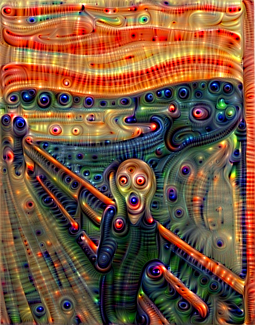
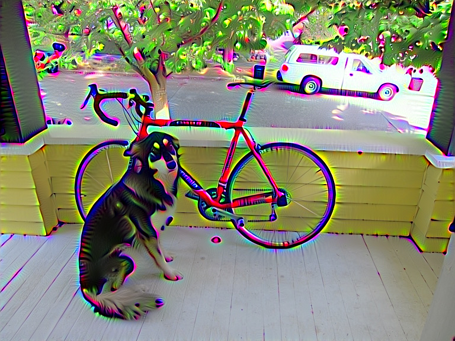
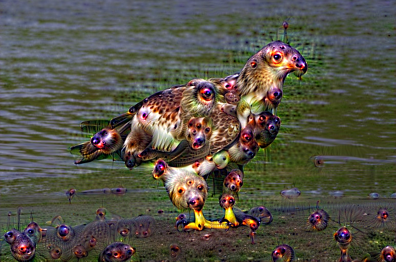
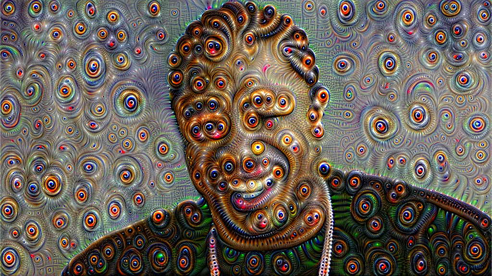
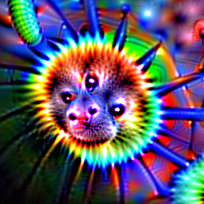

:kr: 다크넷(darknet): C로 작성한 신경망 공개소스 

출처: https://pjreddie.com/darknet

| [다크넷](../README.md) | [설치](../1_SeolChi/SeolChi.md) | [욜로](../2_YOLO/yolo.md) | [이미지넷분류](../3_ImageNet_BunRyu/BunRyu.md) | [악몽](../4_AkMong/AkMong.md) | [재사용신경망](../5_RNN/rnn.md) | [다크고](../6_DarkGo/DarkGo.md) | [꼬맹이망](../7_GgoMaengIi/GgoMaengIi.md) | [분류기벼림](../8_SuRyeon/SuRyeon.md) | [사용방법](../SaYongBeob_Yolo-v3.md) |  
| --- | --- | --- | --- | --- | --- | --- | --- | --- | --- |  

<a name="악몽"></a>
<p align="center"></p>  

## 4. 악몽(Nightmare)

 옛날에, 대학 건물에서(in a University building almost), 하지만 아주(but not quite),
entirely unlike the one you are sitting in right now,
Simonyan, Vedaldi, 그리고 Zisserman는 [훌륭한 발상](http://arxiv.org/pdf/1312.6034v2.pdf)을 했다. 그들은 생각했다, 이봐 우리는 이 신경망을 순방향으로 실행하지 그리고 꽤 잘 동작하지, 근데 왜 역방향으로 안돌리지? 그런식으로 우리는 알아낼수 있다 컴퓨터가 거기에 대해 실제로 생각하는 것을...

 결과 이미지는 너무 소름끼치고, 너무 기괴했다, 그들의 비명은 템플턴까지 들렸다.

<p align="center"></p>

 [많은](http://arxiv.org/pdf/1412.0035v1.pdf) [연구자들](http://arxiv.org/pdf/1412.1897v4.pdf)이 그들의 작업을 확대[했다](http://arxiv.org/pdf/1506.02753.pdf), 구글에 의해 잘 공표된 [게시 블로그](http://googleresearch.blogspot.com/2015/06/inceptionism-going-deeper-into-neural.html)를 포함하여.

 이것은 다른사람이 가진 좋은 발상을 누군가 복사한 것을 내가 복사한 것이다.

### 1) 다크넷으로 악몽 꾸기

 만약 다크넷 설치가 되지않았다면, [먼저 설치](http://pjreddie.com/darknet/install/)하라! 악몽을 꾸미기위해 우리는 VGG-16 미리벼림된 모형을 사용할 것이다. 하지만, 우리는 전체모형이 필요하지 않다, 단지 나선층만, 그래서 우리는 `vgg-conv.cfg`파일을 사용할수 있다(이미 `cfg/` 하위디렉토리에 있어야 한다). 당신이 내려받기에 필요한 미리벼림된 가중값은 [여기(57MB)](http://pjreddie.com/media/files/vgg-conv.weights)에 있다.  

 이제 우리는 첫번째 절에서 본 절규이미지를 생성할수 있다:

```
./darknet nightmare cfg/vgg-conv.cfg vgg-conv.weights data/scream.jpg 10
```

 명령은 다음과 같이 나눈다: 첫번째는 실행파일명 그리고 보조규칙인, `./darknet nightmare`를, 뒤이어 설정파일 그리고 가중값파일인, `cfg/vgg-conv.cfg vgg-conv.weights`를 가진다. 끝으로 수정하기 원하는 이미지 그리고 우리가 목표로 삼은 파일의 설정층인, `data/scream.jpg 10`를 가진다.

 이것은 시간이 좀 걸릴것이다, 특히 CPU만 사용하는경우. 내 기계는 약 15분 걸렸다. 나는 빠르게 악몽을 생성하기 위해 [쿠다 사용하기](../1_SeolChi/SeolChi.md#쿠다)[(영문)](http://pjreddie.com/darknet/install/#cuda)를 강하게 권고한다. 쿠다 사용하기로 타이탄엑스(Titan X)에서 약 7초가 걸린다.

 더 예술적 느낌을 가지기위해 낮은층을 실험해 볼수 있다:

```
./darknet nightmare cfg/vgg-conv.cfg vgg-conv.weights data/dog.jpg 7
```




아니면 더 복잡한 창의행위를 얻기위해 층을 높인다:  

```
./darknet nightmare cfg/vgg-conv.cfg vgg-conv.weights data/eagle.jpg 13
```

  

### 2) 특별한 선택사항

 자신이 생성한 절규 이놈이 내것과 완전히 똑같지 않다는 것을 알수 있다. 그것은 내가 특별한 선택사항을 사용했기 때문이다! 내가 사용한 실제 명령이다:

```
./darknet nightmare cfg/vgg-conv.cfg vgg-conv.weights \
data/scream.jpg 10 -range 3 -iters 20 -rate .01 -rounds 4
```

 다크넷은 연속적인 순환(rounds)에서 이미지를 생성한다, 이전순환의 출력을 다음순환으로 공급한다. 각 순환 이미지 또한 디스크에 기록된다. 각 순환은 반복(iter)횟수에 상당하는 구성이다. 각 반복에서, 다크넷은 상당 규모(scale)로 선택층을 향상하기 위해 이미지를 수정한다. 규모(scale)는 옥타브(octaves) 집합에서 무작위로 선택된다. 층은 가능한 층 범위에서 부작위로 선택된다. 이 절차를 수정하기 위한 명령이다:

  * `-rounds n` : 순환횟수 변경(기본 1). 더많은 순환(rounds)은 더많은 이미지생성을 의미한다 그리고 보통 원본 이미지에 더많이 변경됨을 의미한다.  
  * `-iters n`  : 순환(rounds)당 반복횟수 변경(기본 10). 더많은 반복은 순환(rounds)당 이미지에 더많이 변경됨을 의미한다.
  * `-range n`  : 층의 가능범위(range)를 변경(기본 1). 만약 1로 설정하면, 모든 반복에서 주어진 층만 선택된다. 그렇지 않으면 범위(range)내에서 무작위로 선택된다(예: `10 -range 3`은 9~11층 사이를 선택한다).
  * `-octaves n`: 규모(scale)의 가능한 수를 변경(기본 4). 1 옥타브에서는, 이미지 전체크기만 조사된다. 각 추가적인 옥타브는 이미지의 작은판을 추가한다(이전 옥타브의 3/4크기).
  * `-rate x`   : 이미지에 대한 학습율을 변경(기본 0.05). 높은것은 반복당 더많은 이미지의 변경을 의미한다. 그러나 또한 상당히 불안정하고 부정확하다.
  * `-thresh x` : 확대할 특징에 대한 문턱값 변경(기본 1.0). 평균에서 벗어난 표준편차 `x`값 이상의 특징만 목표층에 확대된다.
  * `-zoom x`   : 각 순환(rounds)이후 이미지에 적용되는 배율(줌)을 변경(기본 1.0). 각 순환(rounds)이후 이미지에 적용하기위한 확대(`x` < 1.0, zoom in) 또는 축소(`x` > 1.0, zoom out)를 선택적으로 추가할수 있다.
  * `-rotate x` : 각 순환(rounds)이후 적용하는 회전변화(기본 0.0). 각 순환(rounds)이후 회전 선택.

 여기에 많이 있다 놀이한 것이! 여기에 다중 순환(rounds)과 꾸준한 확대(zoom in)의 본보기가 있다:

[](https://www.youtube.com/watch?v=qlO4M6MfDFY)

### 3) 작은 모형

 *VGG-16* 은 아주큰 모형이다, 만약  실행중 메모리가 부족한 경우, 대신에 이 모형을 사용해보라!

 *cfg* 파일은 `cfg/` 하위디렉토리에 있다 (또는 [여기](https://github.com/pjreddie/darknet/blob/master/cfg/jnet-conv.cfg)), 가중값은 [여기(72MB)](http://pjreddie.com/media/files/jnet-conv.weights)에서 내려받을수 있다.

```
./darknet nightmare cfg/jnet-conv.cfg jnet-conv.weights \
data/yo.jpg 11 -rounds 4 -range 3
```



### 4) 깊은 꿈과 구글넷 비교

 이 본보기는 *VGG-16* 망을 사용한다. 구글넷은 [개와 민달팽이](http://i.imgur.com/ebk1Cdc.jpg)에 집착하는 것처럼 보이지만, *VGG* 는 오소리두더지(badgermoles) 생산하기를 좋아한다, 설치류와 원숭이 사이의 기괴한 교배다:

<p align="center"></p>  

 *구글넷(GoogleNet)* 이 가진 *VGG* 는 또한 지역 응답 고르개 층이 없다. 결과적으로, 이 악몽은 종종 색이 별빛폭발로 과도포화(hyper-saturated)된다.

<p align="center"></p>  

즐겨라!

[](https://www.youtube.com/watch?v=Qjh6tg4n_ug)

---
