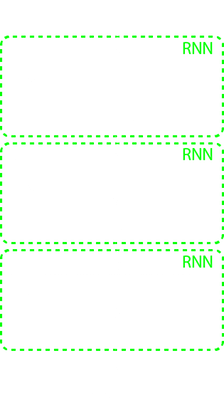
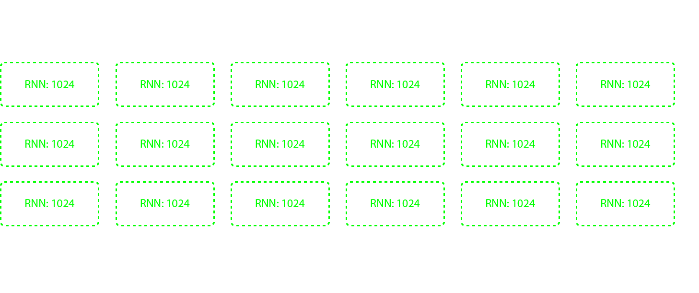

:kr: 다크넷(darknet): C로 작성한 신경망 공개소스 

출처: https://pjreddie.com/darknet

| [다크넷](../README.md) | [설치](../1_SeolChi/SeolChi.md) | [욜로](../2_YOLO/yolo.md) | [이미지넷분류](../3_ImageNet_BunRyu/BunRyu.md) | [악몽](../4_AkMong/AkMong.md) | [재사용신경망](../5_RNN/rnn.md) | [다크고](../6_DarkGo/DarkGo.md) | [꼬맹이망](../7_GgoMaengIi/GgoMaengIi.md) | [분류기수련](../8_SuRyeon/SuRyeon.md) |  
| --- | --- | --- | --- | --- | --- | --- | --- | --- |  

<a name="재사용-신경망"></a>
## 5. 다크넷에서  재사용신경망(RNNs in Darknet)

 재사용신경망(RNN)은 시간이 지남에 따라 변하는 자료를 표현하기위한 강력한 모형이다. 훌륭한 재사용신경망(RNN) 입문서로 지난해부터 게시한 [Andrej Karpathy의 블로그](http://karpathy.github.io/2015/05/21/rnn-effectiveness/)를 나는 적극 추천한다 이것은 그것(RNN)을 구현하는 동안 훌륭한 자원이었다!

 이러한 모형 전부는 동일한 망구조를 사용한다, 3개의 재사용 모듈을 가진 바닐라 재사용신경망(RNN).

<p align="center"></p>  

 각 모듈은 전부연결된층 3개로 구성된다. 입력층은 입력으로부터 현재상태로 정보를 전달한다. 재사용층은 이전상태로부터 현재의 하나로 시간이 지나고(경과한) 정보를 전달한다. 때문에 우리는 입력층과 재사용층 양쪽 모두가 현재상태에 영향을 주길 원한다, 우리는 현재상태를 얻기위해 그 출력을 합한다. 끝으로, 출력층은 재사용신경망(RNN) 모듈의 출력으로 현재상태를 매핑한다.

 망에서 입력은 아스키(ASCII)문자의 [원핫인코딩](https://en.wikipedia.org/wiki/One-hot)이다. 우리는 문자 스트림에서 다음 문자를 예측하기 위해 망을 수련한다. 출력은 소프트맥스 층을 사용한 확률분포로 제한한다.

 때문에 각 재사용층은 현재문자와 지난문자에 관한 정보를 포함한다, 이것은 단어 또는 문장에서 미래의 문자를 예측하기 위해 이 문맥(상황)을 사용할수 있다. 시간의 흐름에 따라 펼쳐지는 수련은 다음과 같다: 

<p align="center"></p>  

 한번에 하나의 문자만 예측함에도 불구하고, 이 망은 매우 강력할수 있다. 평가할 때, 주어진 문장의 가능성을 검토할수 있다, 아니면 우리는 망이 자신의 문자를 생성하도록 할수 있다! 

 문자를 생성하기 위해, 먼저 줄바꿈 `\n` 같은 기호를 입력으로 망에 씨부림한다, 아니면 문장갗은 기호집합을. 그런다음 마지막 기호로 망의 출력을 취한다 그리고 망에 입력으로 다시 공급한다. 이후 망의 출력은 다음 기호에 대한 확률분포이다 우리는 주어짐 분포에서 가장 가능성이 있는 기호나 표본을 취할수 있다.

### 1) 다크넷으로 문자 생성

 먼저 다크넷을 [:kr:설치](../1_SeolChi/SeolChi.md#다크넷-설치)[(영문)](https://pjreddie.com/darknet/install/)해야 한다. 이후 CUDA 또는 OpenCV가 필요없을 것이다. 이것은 [깃허브 저장소](https://github.com/pjreddie/darknet)를 복제하므로 간단하다:

```
git clone https://github.com/pjreddie/darknet
cd darknet
make
```

 일단 자신이 사용하기 원하는 가중값 파일을 고른다, 다음 명령으로 문자를 생성할수 있다:

```
./darknet rnn generate cfg/rnn.cfg <weights>
```

 또한 이 명령에 다양한 플래그를 전달할수 있다:

 * `-len <int>`    : 생성된 문자의 길이 변경, (기본 1,000)
 * `-seed <string>`: 주어진 문자열로 재사용신경망(RNN)에 씨부림, (기본 `\n`)
 * `-srand <int>`  : 뿌림숫자 생성기로 씨부림, 반복적으로 실행하기 위해
 * `-temp <float>` : 표본추출을 위한 온도 설정, (기본 0.7) 

 충분한 짧은-잡담, 어떤 사람 행세를 하자!! 

### 2) 조지 마틴(George R.R. Martin)

<p align="center"></p>

> *JON*
>
> *He leaned close and onions, barefoot from his shoulder. "I am not a purple girl," he said as he stood over him. "The sight of you sell your father with you a little choice."*
> 
> *"I say to swear up his sea or a boy of stone and heart, down," Lord Tywin said. "I love your word or her to me."*
> 
> *"Lord Tywin would have worn them and see my commands." He took the cloth of dragons for his brother to take the crow to the other side of the gallery and the wailing helps her maidenhead of the only trunk of the dead men loved by the time they had come to rest. The red priest was pleased to be done with a smile to show them from the beginning lands and red and strong, and the stables she had been king on the water, and the child will be lost in the night before his father's son. Even his brothers made her way for him and the king to take the swift of the king. The first time will take me for our command," Ned said. "Before an inn, the Sons of the Lord of Light, we must be good beard."*
> 
> *A day and she told herself. The girl was a brothel, and the first thing not to be any sons  that you were so bolder, when you might have come to me. But the most pursuit he would not be betrayed my fool. I should be more than one, he will have the sellsword floor to her death, and my sons are weak and sail."*
> 
> *"And the king has dead," Hizdahr said. "I was a speak of whom you are disappointed."*
> 
> *"I know what you had promised, Your Grace. We ever seen the knights to spare the soldier pines. And so he die," said Ser Alliser.*
> 
> *"The crows will give me when you give her a bit of gold to his head off."*
> 
> *"Then I see me to send your captives, remain your head from the realm."*  

 조금 큰 미리보기가 여기있다! 예를 들어, 존은 "미친년(purple girl)"이 아니다, 그래서 나는 그렇게 생각해 좋니?

 이 분자를 생성하려면 이 가중값파일을 내려받아야 한다: [grrm.weights(36MB)](https://pjreddie.com/media/files/grrm.weights). 그런다음 이 명령을 실행한다:

```
./darknet rnn generate cfg/rnn.cfg grrm.weights -srand 0 -seed JON
```

 다른 문자를 생성하기 위해 `` 또는 ``를 변경할수 있다, 그러면 미쳐 날뛴다! 나는 정말로 바란다 이것에 대해 고소당하지 않기를...

 오에스엑스(OS-X)의 뿌림숫자 생성기는 리눅스(Linux)와 다르다 그러므로 동일한 명령을 실행하면 다른 출력을 얻는다:

> *JON*
> 
> *Each in days and the woods followed his king. "I understand."*
> 
> *"I am not your sister Lord Robert?"*
> 
> *"The door was always some cellar to do his being girls and the Magnar of Baratheon, and there were thousands of every bite of half the same as though he was not a great knight should be seen, and not to look at the Redwyne two thousand men."*
> 
> *"And Ser Kevan should have made a sword with the smallfolk after the lower help, so Lord Arryn was not like to do with me. And he never was being holding only one man did not seem as though the castle was making some ravens from broken and gold, and reached out to one knee. "The Hand of the Free Cities and women are being offered meekly on the Wall, and ended the course of his accusations," said Bran. "My cousin Lannister was the boy. There are worships for hours. A woman," Ser Jorah said drums.*
> 
> *"Ser Jaime was a sure to be a wooden sword. She was the only one of my chain makes you, my lady."*
> 
> *"There are you satisfied, my lord?"*
> 
> *"You have my journey," he said. "We should have killed the Seven Kingdoms. Lord Nestor should not read her if you would have told her of the likes of you think that death as well, and men and had been far to the docks. She didn't know how to find some visit to the king. His sister had seen Asha was being done. "You were to say that you will not provoke you to the wall aoothes, the more reason to take the gold of all the men of your realm with the sense in the back of the sea."*
> 
> *"This is your mother," he told them. "I don't know what I am not without your brother, but that was the Lord of Light has wanted to stand there."*
> 
> *"And if I had a son of mine, my lord?"*
> 
> *Ser Alliser had not been safe first, but the hall was more apt to see the next time. My lord father had risen to join their crowns, when the septons slid the children of dragons, of his swords, and the wildlings and his words were singing the steps. "If you did not let her truly steal or swords?"*
> 
> *"As you wish," said Jojen.*

### 3) 윌리엄 셰익스피어(William Shakespeare)

<p align="center"></p>

```  
    The King hath been bestow'd and do his daughter to
    Have a devil's tale that I will see it so.
    There's more in a man turn'd to us for my sister.
                           [Striking him]
                                                          Exeunt

SCENE II.
Wales. Enter QUEEN, and MISTRESS PAGE
  PISTOL. Do you behold his trunk?
  ALCIBIADES. As a man that I have show'd them
    To expect my cousin, and our revenge
    To show you to my suspect that blows
    And lov'd you to the earth to my deeds will seem,
    And with the sealing of the belly's life
    Hath more than any of it. They say, how then?
    His head is not his bed. Look your shadow
    That gives the hour of them thou be done better.
    Come, let us sleep.
  FIRST WITCH. Sirrah, he shall not be a man,
    In a maid he did confess the modesty
    And make some continual outward woman;
    For your unfirm thy crown. Let him be crack'd
    And fathers on the eastly as they had
    A dagger do a widow of the clock;
    There was not thought to set a penny hold on with her
    With the tyrant that never show'd my power.
    The death of faith, and whate'er came upon him.
    My good lord; but in the man may straight
    As if he sleep the air of England's son,
    Are mortality! Stand father, and o'erreaten
    And banish thee, convey them that thinK's whisper.
                                                               Exit  
```  

가중값 파일: [shakespeare.weights](https://pjreddie.com/media/files/shakespeare.weights)

이 문자를 생성하기 위해 실행한다:

```
./darknet rnn generate cfg/rnn.cfg shakespeare.weights -srand 0
```

 이 본보기는 줄바꿈 기호(`\n`)를 기본 씨뿌림으로 사용한다. 문자 씨뿌림 또는 뿌림숫자 씨뿌림 변경은 샌성된 문자가 변경될 것이다.

 이 모형은 한 파일로된 셰익스피어 전집으로 수련되었다: [shakespeare.txt](https://pjreddie.com/admin/core/file/31/), 원본은 [구텐베르크 프로젝트](http://www.gutenberg.org/ebooks/100)에서

### 4) 레오 톨스토이(Leo Tolstoy)

<p align="center"></p>

> *Chapter 22*
> 
> *The Minister of the household was dissatisfied with him that he had fond of him and say in the same way to his place and laying out at a class, and yet Kamagina began to tell himself, was suddenly a French panic-stricken in his heart. "And I am so much better, while you hear, it's all day!" shouted the princess.*
> 
> *"And Korsunsky?"*
> 
> *"But you have had no mention in order to find anything for her. I couldn't say that something was a certain order and that you know that friend senseless words, and when they have children seen it, and my position is the matter to look at his letter."*
> 
> *"Yes, I must do so. You won't do it, but I can't make you the greatest numerous state of having been on the other, boy. He knew it how they got it at the point of view with which he saw that the candles remained silent, and he had always happened to the enemy of a complicated. The superiors of them where she was continually conscious of his only desire to start from the field of battle air, and a weak indignation on the sleigh.*

가중값 파일: [tolstoy.weights](https://pjreddie.com/media/files/tolstoy.weights)

이 문자를 생성하기 위해 실행한다:

```  
./darknet rnn generate cfg/rnn.cfg tolstoy.weights -srand 0 -seed Chapter  
```  

### 5) 임마누엘 칸트(Immanuel Kant)

<p align="center"></p>

> *Thus, the latter is cogitated in its empirical causality, it is here in the world of sense- an imperative and therefore of homogeneity is in concreto, must by that I have called moral phinosssay or unless we are able to say that it is not contradictorily haveally distinguished from desires to take the state without this faculty the following good, which is the foundation of the categories, and so act in accordance with the laws of nature (despite them and the truth of all minor in the series. This composite is nothing more than the principles of the pure understanding, even in the case of the idea of a transcendental idea. And thus the preposition cannot be inculpable.*
> 
> *Hence it follows that the representation of a supersensible necessity in concreto, as dependent on something merely as a mere form of phenomena, that is, of a supersensible system of nature by which what we have now properly contrary to the concept of freedom, for example, the second the notion of it alone is an absolutely necessary, but that it is a body passed sound simply under the head of the hypothesis.*
> 
> *But the relation of the possibility of all objects of experience, and consequently not according to the laws of nature, which he had not been said, it is only the possibility of the object thereof, as the form in the mere estimate of a supreme way in which they are thought by means of any intuition of the moral law, reason is represented as a duty, that therefore no object to empirical reason has been understood about the influence on the judgement of reason, and as such they are extended of the subject in the synthesis of imagination, and which is independent of that which happens).*

가중값 파일: [kant.weights](https://pjreddie.com/media/files/kant.weights)

이 문자를 생성하기 위해 실행한다:

```
./darknet rnn generate cfg/rnn.cfg kant.weights -srand 0 -seed Thus -temp .8
```

### 6) 슬랙(Slack)

<p align="center"></p>

```  
ztatlock: oh god
ztatlock: <@doug> having a new repository
jrw: good name is fast
jtoman: @Doug yeah, it's always a holiday perfect
jtoman: it was super fun to watch this stuff, may not big up super
    useful features.
talia: i mean the one we are pretty cool but i didn't think of
    anything that doesn't seem to be in the accent -n
ashe2: <@djg> as both the most objects into facebook, and love
    the same thing and really care, when do a lot of PLSE?
bholt: @JohnToman if you merge in HNT?
talia: I mean Reading group then
doug: the lesson has left is badly?
pavpanchekha: @ashe2 no bigger though
pjreddie: I see
jrw: also soundness is a natural number
ericreed: they still want to do it (not support for syntax
    highlighting is pretty good
jroesch: I found a bunch of people sitting right?
pjreddie: it would be good to get an actual undergrad reading group
    today...
doug: <@ashe2> yeah, that's what we need a (jimmyjohns)
ztatlock: @ztatlock uploaded a file:
    https://uw-cse.slack.com/files/pjreddie/F0K073WE0/screen_shot_2015-06-06_at_9_09_43_jpg
doug: the revolution will will crave to sign up for a paper theory
    papers than you have to actually work with the problem of the
    crazy theory after this with uwplse: do someone is here to avoid
    having people could be a but if they didn't understand.
pavpanchekha: That's a good idea
darzu: Maybe the best emoticon  
```  

 나는 이 모형을 게시하지 않을 것이다 하지만 당신은 자신의 슬랙 기록을 내려받을수 있다 그리고 그것으로 모형을 수련하라! 어떻게라고, 묻는건가? 읽어봐라...

### 7) 나만의 모형을 수련(Train Your Own Model)

 또한 새로운 문자 자료로 나만의 모형을 수련할수 있다! 수련 구성파일은 `cfg/rnn.train.cfg`다. 모든 수련을 위해 필요한 것은 자신의 모든 자료가 아스키(ASCII)로된 하나의 문자파일이다. 그런다음 다음 명령을 실행한다:

```
./darknet rnn train cfg/rnn.train.cfg -file data.txt
```

 이 모형은 `train_char_rnn` 함수에서 `src/rnn.c`에 지정된 디렉토리에 주기적인 백업을 저장할 것이다, 당신은 아마도 자기 기계의 좋은 위치로 이 디렉토리를 변경하기를 원할것이다. 수련을 재시작하기 위해 하나의 백업에서 실행할수 있다:

```
./darknet rnn train cfg/rnn.train.cfg backup/rnn.train.backup -file data.txt
```

 만약 많은 자료로 큰 모형을 수련하기를 원한다면 아마도 빠른 GPU에서 실행할 필요가 있을 것이다. CPU에서 수련할수 있다 하지만 많은 시간이 걸릴 것이다, 경고한다!

---
