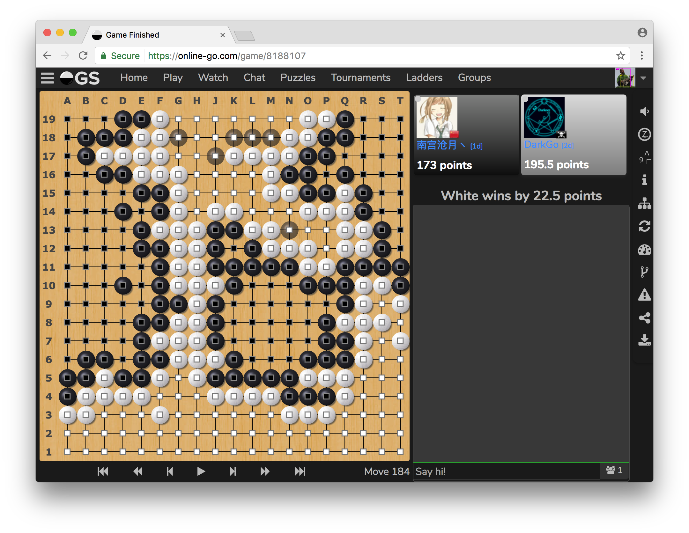

:kr: 다크넷(darknet): C로 작성한 신경망 공개소스 

출처: https://pjreddie.com/darknet

| [다크넷](../README.md) | [설치](../1_SeolChi/SeolChi.md) | [욜로](../2_YOLO/yolo.md) | [이미지넷분류](../3_ImageNet_BunRyu/BunRyu.md) | [악몽](../4_AkMong/AkMong.md) | [재사용신경망](../5_RNN/rnn.md) | [다크고](../6_DarkGo/DarkGo.md) | [꼬맹이망](../7_GgoMaengIi/GgoMaengIi.md) | [분류기벼림](../8_SuRyeon/SuRyeon.md) |  
| --- | --- | --- | --- | --- | --- | --- | --- | --- |  

<a name="다크고"></a>
## 6. 다크고: 다크넷에서 바둑(DarkGo: Go in Darknet)

 알파고는 내게 놀이하기 신경망에 흥미를 가지게 했다.

 나는 아직 그들의 논문을 실제로 읽지 않았다. 하지만 내가 상상하여 구현한 것이 그들의 정책망(policy network)과 비슷한 방법이다. 이것은 바둑놀이에서 가장 가망이 있는 다음수를 예측하는 신경망이다. 당신은 전문꾼을 데리고 놀수 있다 그리고 다음에 일어날 가망이 있는 수가 무엇인지 봐라, 스스로 놀게해라, 아니면 그것에 기대어 놀아봐라!

<p align="center"></p>

 현재 다크고는 약 1단 수준으로 논다. 이것은 미리보기가 없은 단일망에 아주 좋음에도 불구하고, 이것은 현재 판상태만 평가한다.

 나랑 놀자 온라인바둑 서버에서! https://online-go.com/user/view/434218

### 1) 벼림된 모형으로 놀기

 먼저 다크넷을 설치하라, 이것은 다음과 같이 성취할수 있다:

```
git clone https://github.com/pjreddie/darknet
cd darknet
make
```

 또한 가중값파일을 내려받는다:

```
wget pjreddie.com/media/files/go.weights
```

 그런다음 평가모드로 바둑엔진을 실행한다:

```
./darknet go test cfg/go.test.cfg go.weights
```

 이것은 대화형 바둑판을 가져올 것이다. 당신이 할수 있는것:

  * 컴퓨터로부터 첫번째로 제안된 수(이동)로 즉시 놓기(착수)위해 `줄바꿈(Enter)`를 누른다
  * 제안된 숫자로 놓기(착수)위해 `3`같은 숫자를 입력한다
  * 수(이동)를 놓기(착수)위해 `A 15`같은 좌표를 입력한다
  * `A 15`의 어떤 돌을 지우기(c: clear)위해 `c A 15`를 입력한다
  * `A 15`에 흑(b: black)돌을 두기(착수)위해 `b A 15`를 입력한다
  * `A 15`에 백(w: white)돌을 두기(착수)위해 `w A 15`를 입력한다
  * 착수기회를 넘기기(p: pass) 위해 `p`를 입력한다  

즐겨라!

 만약 더 강력한 망을 원한다면, 평가 명령에 `-multi` 플래그를 추가한다. 이것은 더좋은 추정확률을 얻기위해 판을 다중 회전과 뒤집엇서 평가한다. 이것은 CPU에서 속도가 느릴수 있다 하지만 만약 쿠다가 있다면 아주 빠르다.

### 2) 자료

 나는 Hugh Perkins의 [깃허브](https://github.com/hughperkins/kgsgo-dataset-preprocessor)에서 가져온 바둑 자료집합을 사용한다. 내가 다크넷에 공급한 자료는 현재 게임상태를 부호화(인코딩)한 1 채널 이미지다. `1`은 자신의 부분이 있는것이다, `-1`은 자신의 상대 부분이 있는것이다, 그리고 `0`은 빈 공간이 있는것이다. 망은 현재 놀이꾼이 다음 착수 가망이있는 것을 예측한다.

 내가 사용후 미리-처리(전처리)한 전체 자료집합은 [여기(3.0GB)](https://pjreddie.com/media/files/go.train)에서 찾을수 있다. 단지 벼림을 위해서만 필요하다:

 * [go.train](https://pjreddie.com/media/files/go.train)

---
