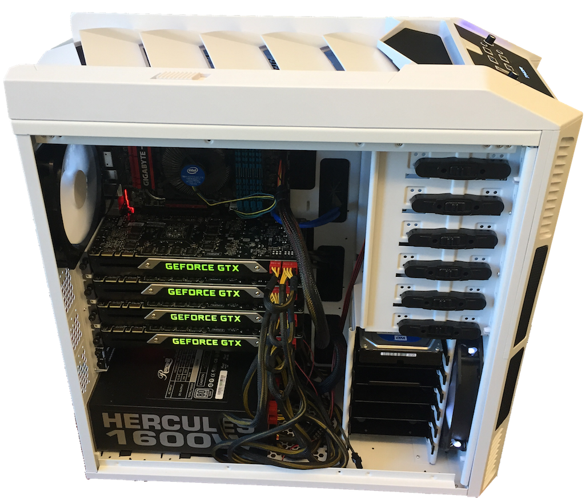
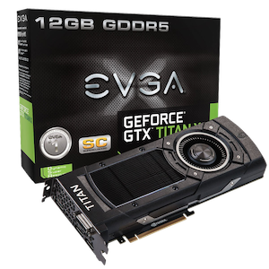
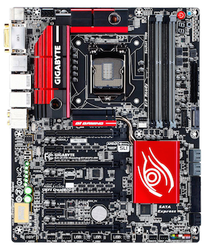
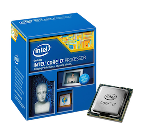
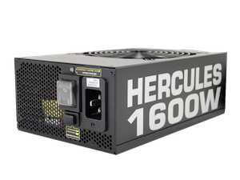
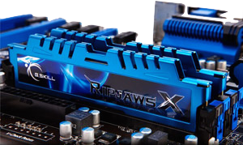
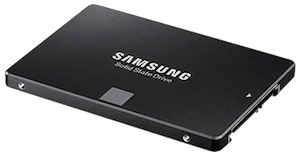
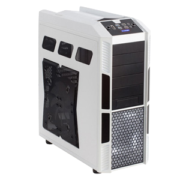

:kr: 다크넷(darknet): C로 작성한 신경망 공개소스 

출처: https://pjreddie.com/darknet

| [다크넷](../README.md) | [설치](../1_SeolChi/SeolChi.md) | [욜로](../2_YOLO/yolo.md) | [이미지넷분류](../3_ImageNet_BunRyu/BunRyu.md) | [악몽](../4_AkMong/AkMong.md) | [재사용신경망](../5_RNN/rnn.md) | [다크고](../6_DarkGo/DarkGo.md) | [꼬맹이망](../7_GgoMaengIi/GgoMaengIi.md) | [분류기벼림](../8_SuRyeon/SuRyeon.md) |  
| --- | --- | --- | --- | --- | --- | --- | --- | --- |  

## 9. 장비 안내: GPU 로 신경망(갱신 2016-01-30)

 나선신경망은 지금 시각컴퓨터(computer vision)에서 열망하는 전부이다. 어째서, 그것은 상대적으로 새롭고 분야가 너무 빨리 이동하기 때문이다 많은 사람들이 벼림하는 최선의 방법에 대해 혼란스러워한다. 나를 따르는 대학원생과 산업연구자들이 내게 물었다 개인기계 아니면 서버중 어떤종류의 하드웨어를 구비해야하는지.

 엔비디아(NVIDIA)는 그들의 새로운 [DIGITS Devbox](https://developer.nvidia.com/devbox)를 구입하기를 원한다, 하지만 8~10주 납품시간과 $15,000(약 1천5백만원)로 책정된것을 모든사람이 원할것이라고 나는 확신하지 않는다. 세금을 제외한 약 $6,000(약 6백만원)에 *Newegg* 에서 단지 몇일만에 배달되는 4 GPU를 가진 자신의것을 만들수 있다.

### 1) 장만한 전체

 당신은 내가 장만한 전체를 [여기](https://secure.newegg.com/Wishlist/SharedWishlistDetail?ID=4bqY9DizYntXlVje%2fC7qLA%3d%3d&&cm_mmc=snc-email-_-sr-_-wishlist-4bqY9DizYntXlVje%2fC7qLA%3d%3d-_-06/13/2018)에서 찾을수 있다. 이것은 그저 그릇이다, 또한 몇개의 GPU가 필요하다. 나는 아마존에서 4개의 EVGA Titan X를 구했다.

  

 컴퓨터 본체는 $1,400(약 1백4십만원)이다, GPU에 $4,000(약 4백만원)를 추가했다 그리고 갈 준비가 됐다! $15,000(약 1천5백만원)보다 훨씬 적다.

### 2) GPU

 아마도 자신이 장만하는 가장 중요하고 가장 삐싼 부분은 GPU일 것이다, 그리고 좋은 이유이다. GPU는 CPU보다 신경망 벼림과 평가에 대해 100배 이상 더 빠르다. 우리의 계산 대부분은 거대 행렬을 함께 곱할 것이다 그래서 우리는 높은 단일 정밀도 성능을 가진 카드를 원한다.

  

#### 2-1) 타이탄 엑스(Titan X)

 이것이 아마도 당신이 원하는 것일 것이다. NVIDIA의 최고급 게이밍 GPU로 설계되었으며, 이것은 단 $1,000(약 1백만원)으로 처리능력이 거의 7 TFLOPS 다 그리고 하나의 기계에 4개를 끼울수 있다. 12GB 영상램(VRAM)에 의해 여분의 여유공간으로 모든 대형 모형을 실행할수 있다.

 온라인상의 사람들은 EVGA와 ASU가 품질면에서 동등하다고 생각하는것 같다 하지만 EVGA 가 더나은 고객지원을 제공한다 그래서 선택했다. 나는 아마존에서 샀다 왜냐하면 다른 선택사항보다 조금 싸고 빨리 출하된다.

#### 2-2) 겨룸: 테슬라 K40, K80, 기타 지포스 900 등

 K40과 K80은 높은 더블정밀도 성능을 제공한다 우리가 정말로 신경쓰지 않는. 단일정밀도 성능은 타이탄엑스(Titan X)와 동등하다 하지만 중요한 표식을 위한 것이다.

 980과 980Ti 같은 기타 고급 GTX 카드는 좋은 단일정밀도 성능을 가진다 타이탄엑스(Titan X)와 비교해 할인된. 하지만 만약 당신이 더많은 서리능력을 원하면 이것은 타이탄엑스(Titan X) 4개를 가진 하나의 기계를 만드는것이 훨씬 간단하다 980 8개를 가진 기계 2대 보다. 여기는 비교다:

| 품종      | 가격    | 처리속도    | 1달러당 처리속도 |  
| ---       | ---:   | ---:       | ---:         |  
| Titan X   | $1,000 | 6.9 TFLOPS | 6.9 GFLOPS/$ |  
| GTX 980Ti | $670   | 5.6 TFLOPS | 8.4 GFLOPS/$ |  
| GTX 980   | $500   | 4.1 TFLOPS | 8.2 GFLOPS/$ |  
| Tesla K40 | $3,000 | 4.3 TFLOPS | 1.4 GFLOPS/$ |  
| Tesla K80 | $5,000 | 8.7 TFLOPS | 1.7 GFLOPS/$ |  

 효율관점에서는 980Ti가 앞쪽으로 나온다. 하지만, 약간의 희생을 한다: 단지 6GB의 영상램(VRAM) 그리고 느린 전체성능. 만약 당신이 돈에 쪼들린다면 나는 980Ti가 좋은 선택이라고 말하고 싶다. 주요 방향은 하지않는 것이다, 어떤 이류로든, 테슬라를 얻는것을. 그것은 당신이 가고자 하는것이 무엇이든 굉장히 비싸다. 만약 당신이 하나의 그릇에서 처리능력 전체를 원한다면 타이탄엑스(Titan X)가 최고의 선택사항이다.

### 3) 마더보드: GIGABYTE GA-X99-UD3P

  

 마더보드의 가장 중요한 관점은 원하는 카드를 모두 넣을수 있는가 이다. 당신이 무엇을 선택하는, 그것이 4개의 카드를 지원할수 있어야 한다. 일반적으로 고가의 게임용 마더보드에서 찾는다. 두배넓은 4개의 카드 공간이 충분간 것으로.

### 4) CPU: 인텔 코어 i7-5820K

  

 훌륭한 CPU는 필요가 없다, 하지만 하나를 선택한다! 12개의 효과적인 코어포함 이것은 아주좋은 선택사항이다.

### 5) 전원공급기: Rosewill Hercules

  

 각 카드는 약 250와트를 소비한다 그리고 컴퓨터의 나머지 부분도 필요하다. 이것은 전원이 1키로와트(1KW)이상 필요함을 의미한다! 안전하게, 나는 정말로 괴물 전원장치로 간다, [Rosewill Hercules 1600W](http://www.newegg.com/Product/Product.aspx?Item=N82E16817182251) 같은. 이것은 엄청난 힘을 가진다; 유일한 쟁점은 크다는 것이다! 나는 이것을 수용하기 위해 나의 케이스에서 팬홀더를 꺼내야 했다.

### 6) 메모리: G.SKILL Ripjaws 4 Series 32GB

  

 저렴한 메모리가 많다. 32GB로 충분해야 한다, 영상램(VRAM)보다 램(RAM)이 적음에도 불구하고!

### 6) SSD: Mushkin Enhanced Reactor 2.5" 1TB

  

 NVIDIA의 devbox 처럼 9TB 레이드 설정을 얻는데 많은 돈을 쓸수 있다 아니면 단지 하나의 SSD를 살수 있다. 이것은 항상 백업 하드드라이브를 가지는것도 좋은 생각이다, 어느쪽이든 동일한 기계에 아니면 벼림된 모형을 원격으로 동기화에 의하여. 그러나 이것은 하나의 SSD가 저장하기에 더 충분할 것이다 그리고 자신의 자료를 제공하기위해, 심지어 동시에 4개의 GPU 까지. 나는 벼림에서 어떠한 지연도 없이 이 하나의 디스크로  4개의 [:kr:빠른 이미지넷 모형(fastest Imagenet models)](../3_ImageNet_BunRyu/BunRyu.md#기준망)[(영문)](http://pjreddie.com/darknet/imagenet/#reference)을 동시에 실행할수 있다. 이 의미는 초당 1,000개의 이미지(약 16MB)를 탑재하는 것이다! 때문에 대부분의 모형은 더 크다 어쨌든 지금은 디스크에서 탑재하는것이 병목이 되지 않는다.

 유일한 단점은 크기이다. 만약 정말 큰 자료집합을 다룬다면 전처리하기 전에 자료 저장을 위해 더큰 하드드라이브가 필요할수 있다.

### 7) 케이스: Rosewill Thor V2

 이것은 아마도 작은 문제이다 하지만 이것은 멋져보여야 한다! 모든 부품을 수월하게 넣을수 있을만큼 충분히 큰 케이스가 정말로 필요할 것이다. 4개의 GPU는 많은 공간을 차지한다! 또한 멋진것을 원한다. *Rosewill Thor* 는 4개의 팬이 이미 설치되었다 그리고 좋은 케이블관리에 걱정할 필요가 없는 충분한 공간이 촣다 오냐하면 나는 케이블이 끔찍하기 때문이다. 이것은 또한 아주 높이 평가했다 그리고 상당히 싸다.

---
