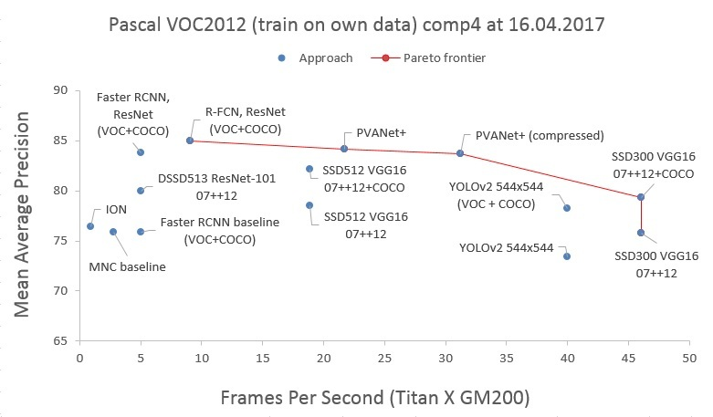
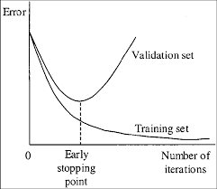
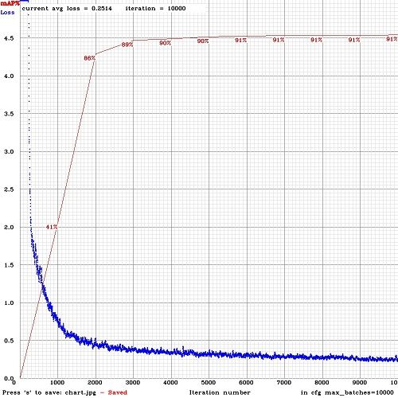
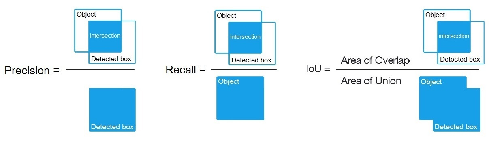
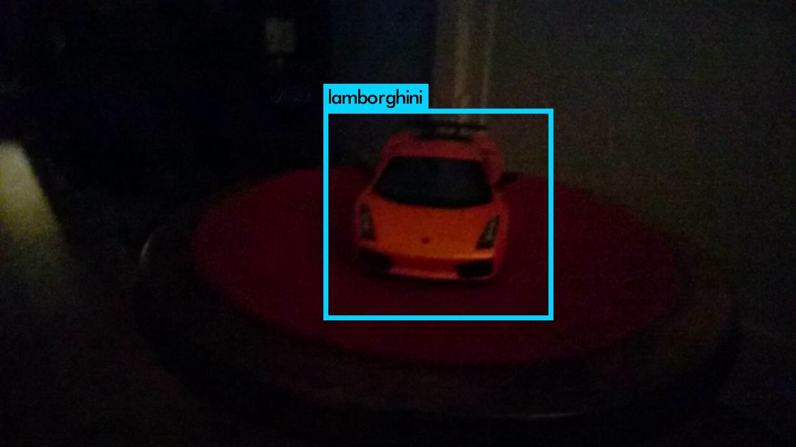

:kr: 다크넷(darknet): 윈도우와 리눅스판 욜로-v2(yolo-v2) 

출처:  
- https://github.com/AlexeyAB/darknet

| [다크넷](./README.md) | [설치](./1_SeolChi/SeolChi.md) | [욜로](./2_YOLO/yolo.md) | [이미지넷분류](./3_ImageNet_BunRyu/BunRyu.md) | [악몽](./4_AkMong/AkMong.md) | [재사용신경망](./5_RNN/rnn.md) | [다크고](./6_DarkGo/DarkGo.md) | [꼬맹이망](./7_GgoMaengIi/GgoMaengIi.md) | [분류기벼림](./8_SuRyeon/SuRyeon.md#CIFAR-10-분류기) | [사용방법](./SaYongBeob_Yolo-v3.md) |  
| --- | --- | --- | --- | --- | --- | --- | --- | --- | --- |  

---  
<p align="center"></p>  

---  
## 다크넷(darknet): 윈도우와 리눅스를 위한 욜로-v3(yolo-v3)과 욜로-v2(yolo-v2)
##### (개체 검출을 위한 신경망) - 텐서코어를 [리눅스](#리눅스에서-컴파일하는-방법)와 [윈도우](#윈도우에서-컴파일하는-방법)에서 사용할 수 있다.  

이 글은 https://github.com/AlexeyAB/darknet 에 작성된 욜로-사용방법만 번역한 것이다.  
자신이 사용할 원본은 https://github.com/AlexeyAB/darknet 주소에서 갈라치길 바란다.  

---  
  #### 나는 한번만 본다(YOLO): 통합된, 실시간 개체검출(판 2와 3)  

  * [쟁점에 대한 설명](https://github.com/AlexeyAB/darknet/issues?q=is%3Aopen+is%3Aissue+label%3AExplanations)  
  * [지원내용](#지원내용)
  * [요구사항](#요구사항)  
  * [미리-수련된 모형](#미리-수련된-모형)  
  * [결과 본보기](#결과-본보기)

---  
  1. [사용 방법](#사용-방법)  
  2. [리눅스에서 컴파일하는 방법](#리눅스에서-컴파일하는-방법)  
  3. [윈도우에서 컴파일하는 방법](#윈도우에서-컴파일하는-방법)  
  4. [벼림하는 방법(물리 시각개체분류 자료, Pascal VOC)](#욜로-v3-v2-벼림방법)  
  5. [벼림하는 방법(사용자가 정한 개체를 검출하기 위하여)](#맞춤-벼림방법)  
  6. [언제 벼림을 중지해야 하는가](#언제-벼림을-중지)  
  7. [물리 시각개체분류(Pascal VOC)로 mAP를 계산하는 방법](#평균정밀도평균-계산)  
  8. [개체검출을 개선하는 방법](#개체검출-개선)  
  9. [개체의 경계상자를 표시하고 설명파일을 생성하는 방법](#개체-경계상자)  
  10. [욜로9000(Yolo9000) 사용](#욜로9000)  
  11. [DLL로 욜로를 사용하는 방법](#욜로DLL)  

---  
| <p align="center"></p> |   https://arxiv.org/abs/1612.08242 |  
| --- | --- |  
| <p align="center"></p> |   https://arxiv.org/abs/1612.08242 |  

---
#### 나는 한번만 본다(YOLO): 통합된, 실시간 개체검출(판 2)

윈도우와 리눅스판 욜로 혼합-작업대(cross-platform), 개체검출을 위한.  
도우미:  
https://github.com/pjreddie/darknet/graphs/contributors  

이 저장소는 리눅스판에서 갈라졌다: https://github.com/pjreddie/darknet  

자세한 내용: [:kr:여기는 국문](https://github.com/zeuseyera/darknet-kr), [여기는 영문](http://pjreddie.com/darknet/yolo/)  


  <a name="지원내용"></a>  
  ##### * 이 저장소가 지원하는 것:  

  * 윈도우와 리눅스 모두  
  * OpenCV 2.x.x 와 OpenCV <= 3.4.0 (3.4.1 이상은 지원 안됨, 하지만 시도할 수 있다)  
  * cuDNN v5 ~ v7 모두  
  * CUDA >= 7.5 이상  
  * 또한 리눅스용 개체공유-라이브러리(SO-library, Shared Object Library) 와 윈도우용 동적연결-라이브러리(DLL, Dynamic Linking Library) 생성  


  <a name="요구사항"></a>  
  ##### * 요구사항  

  * **리눅스 GCC>=4.9 또는 윈도우 마리크로소프트 비주얼 스튜디오 2015 (v140)**: https://go.microsoft.com/fwlink/?LinkId=532606&clcid=0x409  (또는 독립설치 [ISO 이미지](https://go.microsoft.com/fwlink/?LinkId=615448&clcid=0x409))  
  * **CUDA 9.1**: https://developer.nvidia.com/cuda-downloads (리눅스에서 [기반-설치 하기](https://docs.nvidia.com/cuda/cuda-installation-guide-linux/index.html#post-installation-actions)를 한다)  
  * **OpenCV 3.4.0**: https://sourceforge.net/projects/opencvlibrary/files/opencv-win/3.4.0/opencv-3.4.0-vc14_vc15.exe/download  
  * **또는 OpenCV 2.4.13**: https://sourceforge.net/projects/opencvlibrary/files/opencv-win/2.4.13/opencv-2.4.13.2-vc14.exe/download  
    - OpenCV는 이미지 또는 동영상 검출을 보여줄 수 있다 그리고 명령줄에 `-out_filename 출력파일.avi`로 지정된 파일로 결과를 저장한다.  
  * CUDA를 사용하는 경우 **GPU 의 연산능력(Compute Capability) >= 2.0**, 또는 cuDNN+CUDA를 사용하는 경우 **GPU 의 연산능력(Compute Capability) >= 3.0**:  
  https://en.wikipedia.org/wiki/CUDA#GPUs_supported  


  <a name="미리-수련된-모형"></a>  
  ##### * 미리-수련된 모형

  그곳에 구성(cfg)파일 각각에 대한 가중값(weights)파일이 있다(작은크기 -> 빠른 속도와 낮은 정밀도 순으로):

  * `yolo.cfg` (194 MB COCO) - 4 GB GPU-RAM 필요: http://pjreddie.com/media/files/yolo.weights  
  * `yolo-voc.cfg` (194 MB VOC Yolo v2) - 4 GB GPU-RAM 필요: http://pjreddie.com/media/files/yolo-voc.weights
  * `tiny-yolo.cfg` (60 MB COCO) - 1 GB GPU-RAM 필요: http://pjreddie.com/media/files/tiny-yolo.weights
  * `tiny-yolo-voc.cfg` (60 MB VOC) - 1 GB GPU-RAM 필요: http://pjreddie.com/media/files/tiny-yolo-voc.weights
  * `yolo9000.cfg` (186 MB Yolo9000) - 4 GB GPU-RAM 필요: http://pjreddie.com/media/files/yolo9000.weights

  이것(가중값파일)은 컴파일된 근처에 넣어라: `darknet.exe`  

  구성(cfg)파일을 얻을수 있는 경로: `darknet/cfg/`  


  <a name="결과-본보기"></a>  
  ##### * 결과 본보기:  

  "모든것이 놀랍다!"  
  [](https://www.youtube.com/watch?v=VOC3huqHrss)  

  다른것: https://www.youtube.com/channel/UC7ev3hNVkx4DzZ3LO19oebg  

---
<a name="사용-방법"></a>
#### 1. 사용 방법  

##### * `build\darknet\x64\`에서 `.cmd`파일로 사용방법 본보기  

  * `darknet_voc.cmd` - VOC 모형을 `yolo-voc.weights`(194 MB) 와 `yolo-voc.cfg`로 초기화 한다 그리고 이미지파일의 이름 입력을 위해 기다린다
  * `darknet_demo_voc.cmd` - VOC 모형을 `yolo-voc.weights`(194 MB) 와 `yolo-voc.cfg`로 초기화 한다 그리고 자신의 동영상파일을 재생한다 이것은 다음처럼 이름을 고쳐야 한다: test.mp4
  * `darknet_demo_store.cmd` - VOC 모형을 `yolo-voc.weights`(194 MB) 와 `yolo-voc.cfg`로 초기화 한다 그리고 자신의 동영상파일을 재생한다 이것은 다음처럼 이름을 고쳐야 한다: test.mp4, 그리고 결과 저장은: res.avi
  * `darknet_net_cam_voc.cmd` - VOC 모형(194 MB)을 초기화 한다, 네트워크 동영상카메라 mjpeg-뭉치(stream)로 동영상을 재생한다(또한 자신의 전화기로)
  * `darknet_web_cam_voc.cmd` - VOC 모형(194 MB)을 초기화 한다, 웹카메라 0번 으로 동영상을 재생한다
  * `darknet_coco_9000.cmd` - Yolo9000 COCO 모형(186 MB)을 초기화 한다, 그리고 검출을 이미지로 보여준다: dog.jpg
  * `darknet_coco_9000_demo.cmd` - Yolo9000 COCO 모형(186 MB)을 초기화 한다, 그리고 동영상으로 검출을 보여준다(존재한다면): street4k.mp4, 그리고 결과 저장은: res.avi


##### * 명령줄로 사용하는 방법  

 리눅스상에서 `darknet.exe`대신에 `./darknet`을 사용한다, 이것 처럼: `./darknet detector test ./cfg/coco.data ./cfg/yolo.cfg ./yolo.weights`  

  * COCO 모형(194 MB) - 이미지: `darknet.exe detector test data/coco.data yolo.cfg yolo.weights -i 0 -thresh 0.2`  
  * COCO 모형(194 MB) 다른방법 - 이미지: `darknet.exe detect yolo.cfg yolo.weights -i 0 -thresh 0.2`  
  * VOC  모형(194 MB) - 이미지: `darknet.exe detector test data/voc.data yolo-voc.cfg yolo-voc.weights -i 0`  
  * COCO 모형(194 MB) - 동영상: `darknet.exe detector demo data/coco.data yolo.cfg yolo.weights test.mp4 -i 0`  
  * VOC  모형(194 MB) - 동영상: `darknet.exe detector demo data/voc.data yolo-voc.cfg yolo-voc.weights test.mp4 -i 0`  
  * COCO 모형(194 MB) - **res.avi 파일로 결과저장**: `darknet.exe detector demo data/coco.data yolo.cfg yolo.weights test.mp4 -i 0 -out_filename res.avi`  
  * VOC  모형(194 MB) - **res.avi 파일로 결과저장**: `darknet.exe detector demo data/voc.data yolo-voc.cfg yolo-voc.weights test.mp4 -i 0 -out_filename res.avi`  
  * VOC  모형(194 MB) 다른방법 - 동영상: `darknet.exe yolo demo yolo-voc.cfg yolo-voc.weights test.mp4 -i 0`  
  * VOC  모형(60 MB), 동영상을 위해: `darknet.exe detector demo data/voc.data tiny-yolo-voc.cfg tiny-yolo-voc.weights test.mp4 -i 0`  
  * COCO 모형(194 MB), 네트워크-동영상카메라 - 스마트웹캠: `darknet.exe detector demo data/coco.data yolo.cfg yolo.weights http://192.168.0.80:8080/video?dummy=param.mjpg -i 0`  
  * VOC  모형(194 MB), 네트워크-동영상카메라 - 스마트웹캠: `darknet.exe detector demo data/voc.data yolo-voc.cfg yolo-voc.weights http://192.168.0.80:8080/video?dummy=param.mjpg -i 0`  
  * VOC  모형(194 MB) - 웹캠 0번: `darknet.exe detector demo data/voc.data yolo-voc.cfg yolo-voc.weights -c 0`  
  * Yolo9000 모형(186 MB) - 이미지: `darknet.exe detector test cfg/combine9k.data yolo9000.cfg yolo9000.weights`  
  * Yolo9000 모형(186 MB) - 동영상: `darknet.exe detector demo cfg/combine9k.data yolo9000.cfg yolo9000.weights test.mp4`  
  * `data/9k.tree`와 `data/coco9k.map`을 자신의 응용프로그램과 동일한 폴더에 넣는것을 잊지마라 만약 빌드한 응용프로그램으로 cpp 응용프로그램을 사용한다면.
  * `data/train.txt` 이미지 목록 그리고 `result.txt`로 검출 결과를 저장하기 위해 사용:  
  `darknet.exe detector test data/voc.data yolo-voc.cfg yolo-voc.weights -dont_show < data/train.txt > result.txt`  
  이 행을 주석처리한다 그러면 모든 이미지는 ESC버튼을 누를 필요가 없다.  
  https://github.com/AlexeyAB/darknet/blob/6ccb41808caf753feea58ca9df79d6367dedc434/src/detector.c#L509 (509행)


##### * 모든 안드로이드 스마트폰을 가지고 네트워크 동영상-카메라 mjpeg-뭉치(stream) 사용을 위하여  

  1. 안드로이드폰 mjpeg-뭉치(stream) 소프트웨어 내려받기: IP 웹캠 / 스카트 웹캠  

    * 스마트 웹캠 - 선호함: https://play.google.com/store/apps/details?id=com.acontech.android.SmartWebCam2  
    * IP 웹캠: https://play.google.com/store/apps/details?id=com.pas.webcam  

  2. 와이파이(WiFi, 와이파이-라우터를 통해) 또는 유에스비(USB)를 통해 컴퓨터에 자신의 스마트폰을 연결한다  

  3. 자신의 웹캠으로 스마트 웹캠을 시작한다  

  4. 아래의 주소를 대체한다, 스마트폰 응용프로그램(Smart WebCam)에 보이는 주소로, 그리고 실행한다:  

    * COCO 모형(194 MB): `darknet.exe detector demo data/coco.data yolo.cfg yolo.weights http://192.168.0.80:8080/video?dummy=param.mjpg -i 0`  
    * VOC  모형(194 MB): `darknet.exe detector demo data/voc.data yolo-voc.cfg yolo-voc.weights http://192.168.0.80:8080/video?dummy=param.mjpg -i 0`  


<a name="리눅스에서-컴파일하는-방법"></a>  
#### 2. 리눅스에서 컴파일하는 방법  

 다크넷 디렉토리에서 직접 `make`를 한다. `make` 전에, `Makefile`에서 옵션같은 것을 설정할수 있다: [연결](https://github.com/AlexeyAB/darknet/blob/9c1b9a2cf6363546c152251be578a21f3c3caec6/Makefile#L1)  

  * `GPU=1`로 빌드하면 GPU 사용하여 가속하기 위한 CUDA를 포함한다(`/usr/local/cuda`에 CUDA가 있어야 한다)
  * `CUDNN=1`로 빌드하면 GPU 사용하여 벼림가속을 위한 cuDNN v5-v7를 포함한다(`/usr/local/cudnn`에 cuDNN이 있어야 한다)
  * `OPENCV=1`로 빌드하면 OpenCV 3.x/2.4.x를 포함한다 - 동영상파일과 네트워크 카메라 또는 웹캠으로부터 동영상뭉치로 검출할수 있다
  * `DEBUG=1`로 빌드하면 욜로판을 디버그할수 있다
  * `OPENMP=1`로 빌드하면 다중-코어 CPU를 사용하여 가속하기 위한 OpenMP 지원을 포함한다
  * `LIBSO=1`로 빌드하면 `darknet.so` 라이브러리를 만든다 그리고 이진 실행가능 파일은  `uselib`로 이 라이브러리를 사용한다. 또는 `LD_LIBRARY_PATH=./:$LD_LIBRARY_PATH ./uselib test.mp4`로 할수 있다. 자신의 코드에서 개체공유-라이브러리(SO-library)를 사용하는 방법은 - C++ 본보기에서 볼수 있다: https://github.com/AlexeyAB/darknet/blob/master/src/yolo_console_dll.cpp 또는 이런 방법으로 사용한다: `LD_LIBRARY_PATH=./:$LD_LIBRARY_PATH ./uselib data/coco.names cfg/yolov3.cfg yolov3.weights test.mp4`  

 리눅스에서 다크넷을 실행하려면 이글의 본보기를 사용하라, `darknet.exe`대신에 단지 `./darknet`를 사용한다, 예를들어 이 명령을 사용한다: `./darknet detector test ./cfg/coco.data ./cfg/yolo.cfg ./yolo.weights`


<a name="윈도우에서-컴파일하는-방법"></a>
#### 3. 윈도우에서 컴파일하는 방법  

  ```
  MSVS : MicroSoft Visual Studio, 마이크로소프트 비주얼스튜디오
  CUDA : Compute Unified Device Architecture, 연산이 통합된 장치구조
  OpenCV : Open source Computer Vision, 영상계산(컴퓨터영상처리) 자원 공개
  ```

  1. 만약 **MSVS 2015, CUDA 9.1, 와 OpenCV 3.0** 을 가지고 있다면(포함 경로: `C:\opencv_3.0\opencv\build\include` 그리고 `C:\opencv_3.0\opencv\build\x64\vc14\lib`), 그러면 마이크로소프트 비주얼스튜디오를 시작한다, `build\darknet\darknet.sln`를 연다, **x64** 와 **Release** 로 [설정](https://hsto.org/webt/uh/fk/-e/uhfk-eb0q-hwd9hsxhrikbokd6u.jpeg)한다 그리고 `빌드` -> `darknet 빌드`를 실행한다.  
  또한, **cuDNN 7.0** 을 가지고 있다면  윈도우 시스템변수 `cudnn`에 **CUDNN** 의 경로를 추가한다: [참조그림](https://hsto.org/files/a49/3dc/fc4/a493dcfc4bd34a1295fd15e0e2e01f26.jpg)  
  **알림:** 만약 OpenCV를 설치한다면, OpenCV 3.4.0 또는 이전버전을 사용하라. 이것은 C 응용프로그램의 OpenCV 3.4.1에서 버그다([500번](https://github.com/AlexeyAB/darknet/issues/500)을 보라).  

    1-1) `C:\opencv_3.0\opencv\build\x64\vc14\bin`에 있는 `opencv_world320.dll`과 `opencv_ffmpeg320_64.dll`(또는 `opencv_world340.dll`과 `opencv_ffmpeg340_64.dll`) 파일을 찾는다 그리고 `darknet.exe`이 포함된 근처에 넣는다.  

    1-2) `C:\Program Files\NVIDIA GPU Computing Toolkit\CUDA\v9.1`안에 `bin`과 `include`폴더가 있는지 확인한다. 그렇지 않으면, CUDA가 설치된 경로에서 이 폴더로 복사를 한다.  

    1-3) 만약 **CUDNN** 없이 빌드를 원한다면: `\darknet.sln`을 열고 -> 프로젝트 -> 속성 -> C/C++ -> 전처리기 -> 전처리기 정의에서, `CUDNN`을 제거한다.  

  2. 다른 버전의 **CUDA(9.1 아님)** 를 가졌다면 문서편집기를 사용하여 `build\darknet\darknet.vcxproj`를 연다, "CUDA 9.1"이 포함된 2곳을 찾는다 그리고 자신의 버전으로 변경한다, 그런다음 단계1을 수행한다.  

  3. 만약 **GPU가 없다** 면, 하지만 **MSVS 2015 와 OpenCV 3.0** (포함경로: `C:\opencv_3.0\opencv\build\include` 와 `C:\opencv_3.0\opencv\build\x64\vc14\lib`)가 있다, 그러면 마이크로소프트 비주얼스튜디오를 시작하고, `build\darknet\darknet_no_gpu.sln`를 열고, **x64** 와 **Release** 로 설정한다, 그리고 `빌드` -> `darknet_no_gpu 빌드` 를 한다.  

  4. 만약 OpenCV 3.0 대신에 **OpenCV 2.4.13** 을 가지고 있다 그러면 `\darknet.sln`을 열고나서 경로를 변경해야 한다  

    4-1) 프로젝트 -> 속성 -> C/C++ -> 일반 -> 추가 포함 디렉토리에 추가: `C:\opencv_2.4.13\opencv\build\include`  
    4-2) 프로젝트 -> 속성 -> 링커 -> 일반 -> 추가 라이브러리 디렉토리에 추가: `C:\opencv_2.4.13\opencv\build\x64\vc14\lib`  

  5. 만약 가속하기 위해 CUDNN을 포함하여 빌드를 한다 그러면:  

    * **CUDA 9.1을 위한 cuDNN v7.0** 을 내려받고 설치한다: [내려받기](https://developer.nvidia.com/cudnn)  

    * `C:\Program Files\NVIDIA GPU Computing Toolkit\CUDA\v9.1`안에 `bin`과 `include`폴더가 있는지 확인한다. 그렇지 않으면, CUDA가 설치된 경로에서 이 폴더로 복사를 한다.  

    * 윈도우 시스템변수 `cudnn`에 **CUDNN** 의 경로를 추가한다: [참조그림](https://hsto.org/files/a49/3dc/fc4/a493dcfc4bd34a1295fd15e0e2e01f26.jpg)  

    * `\darknet.sln`을 열고 -> 프로젝트 -> 속성 -> C/C++ -> 전처리기 -> 전처리기 정의에, `CUDNN`을 추가한다.  

  **알림:** CUDA는 반드시 마이크로소프트 비주얼스튜디오 2015가 설치된 후에 설치해야 한다.


##### 3-1. 윈도우에서 컴파일하는 방법(맞춤)

 또한, 자신의 `darknet.sln`과 `darknet.vcxproj`를 생성할수 있다, 이 본보기는 CUDA 9.1과 OpenCV 3.0에 대한 본보기다.

 그런다음 생성된 자신의 프로젝트에 추가한다:

  * 프로젝트 -> 속성 -> C/C++ -> 일반 -> 추가 포함 디렉토리에 넣는다:  
    `C:\opencv_3.0\opencv\build\include; ..\..\3rdparty\include; %(AdditionalIncludeDirectories); $(CudaToolkitIncludeDir); $(cudnn)\include`

  * 솔루션 탐색기 탭에서 프로젝트 이름(예: darknet)을 마우스 오른쪽버튼을 눌러 튀어오름 메뉴에서 [`빌드 종속성` -> `사용자 지정 빌드`](./images/VS2013-R-5.jpg)를 클릭하고, 열린 창에서 CUDA 9.1 또는 자신이 가진 판을 선택지정한다.

  * `\src`에서 모든 `.c`와 `.cu` 파일을 프로젝트에 추가한다.

  * 프로젝트 -> 속성 -> 링커 -> 일반 -> 추가 라이브러리 디렉토리에 추가:  
    `C:\opencv_3.0\opencv\build\x64\vc14\lib; $(CUDA_PATH)lib\$(PlatformName); $(cudnn)\lib\x64; %(AdditionalLibraryDirectories)`  

  * 프로젝트 -> 속성 -> 링커 -> 입력 -> 추가 종속성에 추가:  
    `..\..\3rdparty\lib\x64\pthreadVC2.lib; cublas.lib; curand.lib; cudart.lib; cudnn.lib; %(AdditionalDependencies)`  

  * 프로젝트 -> 속성 -> C/C++ -> 전처리기 -> 전처리기 정의에 추가:  
    `OPENCV; _TIMESPEC_DEFINED; _CRT_SECURE_NO_WARNINGS; _CRT_RAND_S; WIN32; NDEBUG; _CONSOLE; _LIB; %(PreprocessorDefinitions)`

  * .exe ([X64 와 Release](./images/uhfk-eb0q-hwd9hsxhrikbokd6u.jpeg))로 컴파일한다 그리고 .exe 근처에 .dll을 넣는다:  

    - `\3rdparty\dll\x64`에서 `pthreadVC2.dll, pthreadGC2.dll`  
    - `C:\Program Files\NVIDIA GPU Computing Toolkit\CUDA\v9.1\bin`에서, CUDA 9.1을 위한 91 또는 자신의 판 `cusolver64_91.dll, curand64_91.dll, cudart64_91.dll, cublas64_91.dll`  
    - OpenCV 3.2를 위하여: `C:\opencv_3.0\opencv\build\x64\vc14\bin`에서 `opencv_world320.dll`과 `opencv_ffmpeg320_64.dll`  
    - OpenCV 2.4.13를 위하여: `C:\opencv_2.4.13\opencv\build\x64\vc14\bin`에서 `opencv_core2413.dll`과 `opencv_highgui2413.dll`  


<a name="욜로-v3-v2-벼림방법"></a>   
#### 4. 벼림하는 방법(물리 시각개체분류 자료, Pascal VOC)  

  1. http://pjreddie.com/media/files/darknet19_448.conv.23 에서 나선단에 대한 미리-벼림된 가중값(76 MB)을 내려받는다: 그리고 `build\darknet\x64`에 넣는다.

  2. Pascal VOC 자료를 내료받고 `build\darknet\x64\data\voc` 폴더에 묶음을 푼다 이것은 `build\darknet\x64\data\voc\VOCdevkit\`폴더가 생성된다:

    - http://pjreddie.com/media/files/VOCtrainval_11-May-2012.tar
    - http://pjreddie.com/media/files/VOCtrainval_06-Nov-2007.tar
    - http://pjreddie.com/media/files/VOCtest_06-Nov-2007.tar

    2-1) `build\darknet\x64\data\voc`폴더에 `voc_label.py`파일을 내려받는다: http://pjreddie.com/media/files/voc_label.py

  3. 윈도우를 위한 파이썬을 내려받고 설치한다: https://www.python.org/ftp/python/3.5.2/python-3.5.2-amd64.exe

  4. 명령을 실행한다: `python build\darknet\x64\data\voc\voc_label.py`(이것은 2007_test.txt, 2007_train.txt, 2007_val.txt, 2012_train.txt, 2012_val.txt 파일을 생성하기위한 것이다)  

  5. 명령을 실행한다: `type 2007_train.txt 2007_val.txt 2012_*.txt > train.txt`(이것은 위에서 생성한 파일을 하나의 2007_train.txt 파일로 합치는 것이다)

  6. `yolo-voc.2.0.cfg` 파일(의 3행, 4행을)에서 `batch=64`와 `subdivisions=8`로 설정한다: [연결(2행)](https://github.com/AlexeyAB/darknet/blob/master/build/darknet/x64/yolo-voc.2.0.cfg#L2)

  7. `train_voc.cmd`를 사용하여 벼림을 시작한다 아니면 명령행을 사용한다:  
    `darknet.exe detector train data/voc.data yolo-voc.2.0.cfg darknet19_448.conv.23`  
    ( **알림:** 손실-창을 해제하기 위해서는 `-dont_show`표기를 사용한다. 만약 CPU 벼림은 `darknet.exe`대신에 `darknet_no_gpu.exe`을 사용한다. )  

  만약 필요한 경우 `build\darknet\x64\data\voc.data` 파일에서 경로를 변경한다.  

  벼림에 대한 추가정보는 연결로... : [:kr:국문](./2_YOLO/yolo.md#시각개체분류-딱지-생성), [영문](http://pjreddie.com/darknet/yolo/#train-voc)

  **알림:** 만약 벼림하는 동안 `avg`(손실, 오차) 영역에 대하여 `nan`값을 봤다 - 그러면 벼림이 잘못된 것이다, 하지만 만약 `nan`이 다른 행에 있다 - 그러면 벼림이 잘 되는 것이다.


##### 4-2. 다중-GPU를 가지고 벼림하는 방법

  1. 먼저 약 1000번 반복에 대해 하나의 GPU로 벼림한다:  
  `darknet.exe detector train data/voc.data yolo-voc.2.0.cfg darknet19_448.conv.23`

  2. 그런다음 중지한다 그리고 약간 벼림된 모형 `/backup/yolo-voc_1000.weights`을 사용하여 다중GPU를 가지고 벼림을 한다(4개의 GPU 까지):  
  `darknet.exe detector train data/voc.data yolo-voc.2.0.cfg /backup/yolo-voc_1000.weights -gpus 0,1,2,3`

  적은 자료집합의 경우는 때대로 학습률을 줄이는 것이 더 좋다, 4 GPU 집합에 대하여 `learning_rate = 0.00025`(즉, learning_rate = 0.001/GPU수). 이 경우 또한 자신의 구성파일(.cfg 파일)에서 `burn_in =`을 `max_batches =`의 4x 배로 늘린다. 즉, `1000` 대신에 `burn_in = 4000`을 사용한다.  

  https://groups.google.com/d/msg/darknet/NbJqonJBTSY/Te5PfIpuCAAJ

<a name="맞춤-벼림방법"></a>
#### 5. 벼림하는 방법(사용자가 정한 개체를 검출하기 위하여)  

  1. `yolo-voc.2.0.cfg`와 같은 내용으로 `yolo-obj.cfg`파일을 생성한다(또는 `yolo-voc.2.0.cfg`를 `yolo-obj.cfg`로 복사) 그리고:  

    * batch 행을 [`batch=64`](https://github.com/AlexeyAB/darknet/blob/master/build/darknet/x64/yolo-voc.2.0.cfg#L2)로 변경한다
    * subdivisions 행읗 [`subdivisions=8`](https://github.com/AlexeyAB/darknet/blob/master/build/darknet/x64/yolo-voc.2.0.cfg#L3)로 변경한다
    * `classes=20` 행을 자신의 개체개수로 변경한다:
    * 237행에서 [`filters=125`] 을: filters=(classes + 5)x5 로 변경한다:  
      그러므로 만약 `classes=1`이면 `filters=30`이 된다. 만약 `classes=2`이면 `filters=35`로 쓴다.  
      ( 구성파일에 **filters=(classes + 5)x5)** 로 쓰지 마라! )  

      ( 일반적으로 `filters`는 `classes`, `coords`와 `num`의 개수에 종속된다, 즉, filters=`(classes + coords + 1)*num`, 여기에서 `num`는 고정자(anchor)의 개수이다. )

      그래서 본보기에 대해, 2개의 개체를 위해, 자신의 `yolo-obj.cfg`파일은 행이 아래처럼 `yolo-voc.2.0.cfg`와 달라야 한다:  

      ```
      [convolutional]
      filters=35

      [region]
      classes=2
      ```

  2. `build\darknet\x64\data\`폴더에 `obj.names`파일을 생성한다, 개체 이름을 가진 - 다른 행에 각각

  3. `build\darknet\x64\data\`폴더에 `obj.data`파일을 생성한다, (여기에서 **classes = 개체 개수**)를 담고있는

    ```
    classes= 2
    train  = data/train.txt
    valid  = data/test.txt
    names = data/obj.names
    backup = backup/
    ```

  4. `build\darknet\x64\data\obj\`폴더에 자신의 개체 이미지파일(.jpg)을 넣는다

  5. 자신의 자료집합인 이미지에 개체 각각의 딱지(label)를 지정해야 한다. 개체의 경계상자 표식과 설명파일을 생성하기 위해 **시각 GUI 소프트웨어** 를 사용하라: https://github.com/AlexeyAB/Yolo_mark  

    이것은 `.jpg` 이미지파일 각각에 대해 `.txt` 파일을 생성한다 - 동일 폴더에 동일한 이름으로, 하지만 `.txt`확장자, 그리고 파일로 쓴다: 이미지상의 개체 번호와 개체 좌표, 다른 행에 개체 각각에 대해:  
    `<object-class> <x> <y> <width> <height>`  

    여기에서:  
    * `<object-class>` - `(classes-1)`을 개체번호 정수 `0`부터
    * `<x_center> <y_center> <width> <height>` - 이미지의 너비와 높이에 관련된 실수값, 이것은 0.0 ~ 1.0 이다
    * 예를들어: `<x> = <absolute_x> / <image_width>` 또는 `<height> = <absolute_height> / <image_height>`
    * 주의: `<x_center> <y_center>` - 이것은 사각형의 중심이다 (상-좌 모서리가 아니다)

    예를들어 `img1.jpg`에 대해 담고있는 `img1.txt`가 생성된다:

    ```
    1 0.716797 0.395833 0.216406 0.147222
    0 0.687109 0.379167 0.255469 0.158333
    1 0.420312 0.395833 0.140625 0.166667
    ```

  6. `build\darknet\x64\data\`폴더에 `train.txt`파일을 생성한다, 자신의 이미지 파일이름을 가진, 다른행에 각각의 파일이름, `darknet.exe`에 상대경로를 가진, 담고있는 예를 들면:

  ```
  data/obj/img1.jpg
  data/obj/img2.jpg
  data/obj/img3.jpg
  ```

  7. 나선단에 대해 [미리-벼림된 가중값(76 MB)](http://pjreddie.com/media/files/darknet19_448.conv.23)을 내려받는다. 그리고 `build\darknet\x64`폴더에 넣는다.

  8. 명령행을 사용하여 벼림을 시작한다:  
  `darknet.exe detector train data/obj.data yolo-obj.cfg darknet19_448.conv.23`  

    리눅스에서 벼림하기위해 사용하는 명령: `./darknet detector train data/obj.data yolo-obj.cfg darknet19_448.conv.23` (`darknet.exe`대신에 `./darknet`사용)

    * `yolo-obj_last.weights`파일은 100번 반복마다 `build\darknet\x64\backup\`에 저장된다
    * `yolo-obj_xxxx.weights`파일은 1000번 반복마다 `build\darknet\x64\backup\`에 저장된다
    * 손실-창을 해제하기 위해 `darknet.exe detector train data/obj.data yolo-obj.cfg darknet19_448.conv.23 -dont_show` 사용, Amazaon EC2 클라우드처럼 감시없이 벼림하는 경우
    * GUI없이 원격서버로 벼림하는 동안 mAP와 손실-챠트(Loss-chart)를 보기위해, `darknet.exe detector train data/obj.data yolo-obj.cfg darknet19_448.conv.23 -dont_show -mjpeg_port 8090 -map`명령을 사용한다 그런다음 크롬/파이어폭스 브라우저에서 `http://ip-address:8090`URL을 연다

  8-1) 벼림을 위해 4세대마다 계산한 평균정밀도평균(mAP: mean Average Precisions)을 가짐(`obj.data`파일에 `valid=valid.txt`또는 `train.txt`을 설정) 그리고 실행: `darknet.exe detector train data/obj.data yolo-obj.cfg darknet19_448.conv.23 -map`

  9. 벼림이 완료된 후에 - `build\darknet\x64\backup\`경로에서 `yolo-obj_final.weights`결과를 얻는다

    * 매 1000번 반복후 중지할수 있다 그리고 나중에 이 시점부터 벼림을 시작한다. 예를들어, 2000번 반복후에 벼림을 중지할수 있다, 그리고 나중에 `build\darknet\x64\backup\`에서 `build\darknet\x64\`로 `yolo-obj_2000.weights`을 복사한다 그리고 이것을 사용하여 벼림을 시작한다: `darknet.exe detector train data/obj.data yolo-obj.cfg yolo-obj_2000.weights`

    * 또한 당신은 모두 45,000번 반복보다 빠르게 결과를 얻을수 있다.

    **알림:** 만약 벼림하는 동안 avg(손실, 오차) 영역에 대하여 nan값을 봤다 - 그러면 벼림이 잘못된 것이다, 하지만 만약 nan이 다른 행에 있다 - 그러면 벼림이 잘 되는 것이다.

    **알림:** 만약 자신의 구성파일에서 `width=` 또는 `height=`를 변경했다, 그러면 새로운 너비와 높이를 반드시 32로 나눌수 있어야 한다.

    **알림:** 벼림후 검출을 위해 이런 명령을 사용한다: `darknet.exe detector test data/obj.data yolo-obj.cfg yolo-obj_8000.weights`

    **알림:** 만약 `메모리 부족(Out of memory)`이 발생한다, 그러면 `.cfg`파일에서 `subdivisions=8`을 키워야 한다, 16 또는 32: [연결](https://github.com/AlexeyAB/darknet/blob/master/build/darknet/x64/yolo-voc.2.0.cfg#L3) 의 3행을 수정한다


##### 5-2. 꼬맹이-욜로(tiny-yolo) 벼림하는 방법(자기맞춤 개체 검출을 위해)

  위에 설명한것 처럼 욜로모형 전체에 대해 모두 동일 단계로 수행한다. 이것을 제외한 부문을 가지고:

  * tiny-yolo-voc를 위한 기본 가중값파일을 내려받는다: http://pjreddie.com/media/files/tiny-yolo-voc.weights
  * 명령을 사용하여 미리-벼림된 가중값 `tiny-yolo-voc.conv.13`를 가져온다: `darknet.exe partial cfg/tiny-yolo-voc.cfg tiny-yolo-voc.weights tiny-yolo-voc.conv.13 13`
  * `yolo-voc.2.0.cfg` 대신에 `cfg/tiny-yolo-voc.cfg`를 기반으로 자기맞춤 모형 `tiny-yolo-obj.cfg`을 만들어라
  * 벼림 시작: `darknet.exe detector train data/obj.data tiny-yolo-obj.cfg tiny-yolo-voc.conv.13`

  다른 모형을 기반으로 욜로를 벼림하기 위해( [DenseNet201-Yolo](https://github.com/AlexeyAB/darknet/blob/master/build/darknet/x64/densenet201_yolo.cfg) 또는 [ResNet50-Yolo](https://github.com/AlexeyAB/darknet/blob/master/build/darknet/x64/resnet50_yolo.cfg) ), 이 파일에 표시된대로 미리-벼림된 가중값을 내려받아 얻을수 있다: https://github.com/AlexeyAB/darknet/blob/master/build/darknet/x64/partial.cmd  
  만약 다른 모형을 기반으로 하지 않은 자기맞춤 모형을 만든다, 그러면 미리-벼림됨 가중값 없이 벼림할수 있다, 이때 뿌린 초기 가중값이 사용된다.


<a name="언제-벼림을-중지"></a>   
#### 6. 언제 벼림을 중지해야 하는가  

 각 분류(개체)에 대해 보통 2,000번 반복이면 충분하다, 하지만 전체(자료집합 전체)로 적어도 4,000번 반복한다. 하지만 더 정밀한 정의를 위해 벼림을 중단 해야만 할때, 다음 설명을 사용하라:

  1. 벼림하는 동안, 다양한 오류지수를 볼 것이다, 그리고 **0.060730 avg** 가 더이상 줄지 않을때 멈춰야 한다:

  > Region Avg IOU: 0.798363, Class: 0.893232, Obj: 0.700808, No Obj: 0.004567, Avg Recall: 1.000000,  count: 8
  > Region Avg IOU: 0.800677, Class: 0.892181, Obj: 0.701590, No Obj: 0.004574, Avg Recall: 1.000000,  count: 8
  >
  > **9002**: 0.211667, **0.060730 avg**, 0.001000 rate, 3.868000 seconds, 576128 images
  > Loaded: 0.000000 seconds

    * **9002** - 반복 횟수(사리수, batch)
    * **0.060730 avg** - 평균손실(오차) - **낮을수록, 더 좋다**

  많은 반복에서 평균손실 **0.xxxxxx avg** 이 더이상 줄지않는 것을 봤을때 그때 벼림을 중지해야만 한다.

  2. 일단 벼림이 멈추면, `darknet\build\darknet\x64\backup`에서 `.weights`파일의 마지막 일부를 가져와야 한다, 그리고 그중에 최적을 선택한다:

   예를들어, 9,000번 반복후에 벼림을 중지했다, 하지만 최적의 결과는 이전 가중값중에서 하나를 가질수 있다(7000, 8000, 9000). 이것은 심한(과도)적합으로 인해 발생될수 있다. **과도적합(Overfitting)** 의 경우 벼림-자료집합에서 이미지로 개체검출을 할때, 모든 다른 이미지로 개체검출을 할수 없다. 반드시 **이른 중지지점, Early Stopping Point** 에서 가중값을 가져와야 한다:

    
  이른 중지지점(Early Stopping Point)에서 가중값을 가져오기 위해!

  2-1) 먼저, 자신의 `obj.data`파일안에 검증 자료집합 `valid = valid.txt`에 경로를 반드시 지정해야 한다(`valid.txt`형식을 `train.txt`처럼), 그리고 만약 검증이미지가 없다면, 그냥 `data\train.txt`를 `data\valid.txt`로 복사한다.

  2-2) 만약 벼림이 9,000번 반복후에 중지되었다면, 이전가중값 일부를 검증하기 위해 이 명령을 사용한다:

  ( 만약 다른 깃허브 저장소를 사용한다, 그러면 `darknet.exe detector map`... 대신에 `darknet.exe detector recall`... 을 사용한다 )

    * `darknet.exe detector map data/obj.data yolo-obj.cfg backup\yolo-obj_7000.weights`
    * `darknet.exe detector map data/obj.data yolo-obj.cfg backup\yolo-obj_8000.weights`
    * `darknet.exe detector map data/obj.data yolo-obj.cfg backup\yolo-obj_9000.weights`

  그리고 각 가중값(7000, 8000, 9000)에 대해 마지막 출력행을 비교한다:

  가장높은 mAP(평균정밀도 평균, mean Average Precision) 또는 **교차겹침결합(IoU, Intersect over Union)** 을 가진 가중값 파일을 선택한다

  예를들어, **더큰 IoU** 는 `yolo-obj_8000.weights`가중값이다 - 그러면 검출을 위해 이 가중값을 사용한다.  

  아니면 그냥 `-map` 표기를 하고 벼림한다:  
  `darknet.exe detector train data/obj.data yolo-obj.cfg darknet19_448.conv.23 -map`  
  ```  
  주의:
    -map 는 평균정밀도평균 mAP를 의미하는 map 임을 기억하라.
    형식, 양식등을 의미하는 지도(map) 의미가 아님.
  ```  
  그러면 손실-챠트 창에서 mAP-챠트(적색)를 볼수있다. 평균정밀도 평균(mAP)는 `valid=valid.txt`파일을 사용하여 4세대(Epoch) 마다 계산된다 이것은 `obj.data`파일에 지정된 것이다(`1세대(Epoch) = train.txt의 이미지수 / batch` 반복)

    

 맞춤 개체검출 본보기: `darknet.exe detector test data/obj.data yolo-obj.cfg yolo-obj_8000.weights`  

    * **IoU:** 개체의 교차겹침결합(Intersect over Union) 평균이다 그리고 특정한 문턱값 = 0.24 에 대한 검출이다.

    * **mAP:** 각 분류에 대한 `평균정밀도(Average Precision)`의 평균(mean)값이다, 여기에서 `평균정밀도`는 동일등급을 위해 문턱이상(각 검출가능한) 각각에 대한 PR-곡선상 11 지점의 평균값이다(PascalVOC 관점에서 정밀도-기억(Precision-Recall), 여기에서 Precision = TP/(TP+FP) 그리고 Recall=TP/(TP+FN) ), 11 페이지:  
    http://homepages.inf.ed.ac.uk/ckiw/postscript/ijcv_voc09.pdf

 평균정밀도 평균(mAP)은 PascalVOC 경쟁(대회)에서 기본 정밀도 측정법 이다, 이것은 MS COCO 경쟁(대회)에서 **AP50 측정법과 동일하다**. 위키의 관점에서, 정밀도(Precision)와 기억(재현, Recall) 지표는 PascalVOC 경쟁(대회)과는 약간 다른 의미를 가진다, 하지만 **교차겹침결합(IoU: Intersect over Union)은 항상 동일한 의미다**.

    


<a name="평균정밀도평균-계산"></a>  
#### 7. 물리 시각개체분류(Pascal VOC)로 mAP를 계산하는 방법  

 1. PascalVOC-2007-test 로 평균정밀도평균(mAP: mean Average Precision)을 계산하기 위해:

  * PascalVOC 자료집합을 내려받고, Python 3.x을 설치하고 `2007_test.txt`파일을 가져온다 여기에 설명된 대로:  
  https://github.com/AlexeyAB/darknet#how-to-train-pascal-voc-data
  * 그런다음 `build\darknet\x64\data\`폴더에 https://raw.githubusercontent.com/AlexeyAB/darknet/master/scripts/voc_label_difficult.py 파일을 내려받는다 그런다음 `difficult_2007_test.txt`파일을 얻기 위해 `voc_label_difficult.py`를 실행한다.
  * 주석을 해제하기 위해 이 줄에서 `#`문자를 제거한다:  
  https://github.com/AlexeyAB/darknet/blob/master/build/darknet/x64/data/voc.data#L4 (4행)
  * 그런다음 평균정밀도평균(mAP: mean Average Precision)을 얻기위한 2가지 방법이 있다:  
    ㄱ) 다크넷 + 파이썬 사용: `build/darknet/x64/calc_mAP_voc_py.cmd`파일 실행 - `yolo-voc.cfg`모형에 대해 mAP = 75.9%를 얻을 것이다.  
    ㄴ) 이 가지의 다크넷 사용: `build/darknet/x64/calc_mAP.cmd`파일 실행 - `yolo-voc.cfg`모형에 대해 mAP = 75.8%를 얻을 것이다.

  ( 이 글은 YOLOv2 416×416에 대해 mAP = 76.8% 값을 명시했다, 4 페이지 표-3: https://arxiv.org/pdf/1612.08242v1.pdf. 우리는 낮은값을 가진다 - 아마도 실제로 검출된 코드와 약간 다른 소스코드로 벼림된 모형이기 때문일 것이다 )

  * 만약 `tiny-yolo-voc.cfg`모형에 대한 mAP를 얻기를 원한다, 그러면 `.cmd`파일에서 `tiny-yolo-voc.cfg`행을 주석해제 하고 `yolo-voc.cfg`행을 주석처리 한다.
  * 만약 Python 3.x 대신에 Python 2.x를 가지고 있다, 그리고 만약 mAP를 얻기위해 다크넷+파이썬 방식을 사용한다, 그러면 자신의 `.cmd`파일에서 `reval_voc.py`와 `voc_eval.py`를 사용하라, 이 폴더의 `reval_voc_py3.py`와 `voc_eval_py3.py` 대신에:  
  https://github.com/AlexeyAB/darknet/tree/master/scripts


##### 7-2 맞춤 개체검출

 맞춤 개체검출의 본보기: `darknet.exe detector test data/obj.data yolo-obj.cfg yolo-obj_8000.weights`

| <p align="center"></p>  |
| --- |
| <p align="center"></p>  |


<a name="개체검출-개선"></a>
#### 8. 개체검출을 개선하는 방법  

1. 벼림 전:

  * 자신의 `.cfg`파일에서 `random=1` 표시 설정 - 이것은 다른 해상도로 욜로를 벼림하여 정밀도가 증가된다: [연결](https://github.com/AlexeyAB/darknet/blob/master/cfg/yolo-voc.2.0.cfg#L244) (244행)

  * 자신의 `.cfg`파일에서 망 해상도를 증가한다(`height=608`, `width=608` 또는 모든 32의 배수값) - 정밀도가 증가할 것이다.

  * 자신의 벼림 자료집합은 다른 개체의 이미지를 포함한 것이 바람직하다 - 축척, 회전, 조명, 다른 쪽으로 부터, 다란 배경으로 - 가급적이면 각 분류에 대해 2,000개 다른 이미지 또는 그 이상을 가지고 있어야 한다, 그리고 `2000*classes`번 반복 또는 그 이상 벼림을 해야한다.

  * 자신의 벼림 자료집합은 검출을 원하지 않는 개체는 딱지가없는 이미지를 포함한 것이 바람직하다 - 경계상자 없는 음성표본(Negative Sample: 목표값이 0, 내용없는 `.txt`파일) - 개체가 있는 이미지와 마찬가지로 음성표본(Negative Sample)도 많이 사용한다

  * 각 이미지에서 많은 수의 개체를 가지고 벼림을 위해, `.cfg`파일에서 마지막 `[yolo]`단 또는 `[region]`에 참여(parameter)를 `max=200` 또는 높은 값으로 추가한다( YoloV3로 검출할수있는 개체 전체 최대개수는 `0,0615234375*(width*height)`이다 여기에서 `width`와 `height`는 `.cfg`파일에서 `[net]`(망정보) 단의 참여(parameter)이다 )

  * 벼림 가속을 위해(검출 정밀도 감소됨) 전이학습(Transfer-Learning) 대신에 미세조정(Fine-Tuning)을 한다, `stopbackward=1`참여 설정은 여기에: https://github.com/AlexeyAB/darknet/blob/cad4d1618fee74471d335314cb77070fee951a42/cfg/yolo-voc.2.0.cfg#L202 (202행)  


2. 벼림 후 - 검출을 위해:

  * 자신의 `.cfg`에서 망 해상도를 높인다 (`height=608`와 `width=608`) 또는 (`height=832`와 `width=832`) 또는 (모든 32배수의 값) - 이것은 정밀도가 증가한다 그리고 작은 개체를 검출할수 있다: [연결(4행)](https://github.com/AlexeyAB/darknet/blob/master/cfg/yolo-voc.2.0.cfg#L4)

    - 이것은 망을 다시 벼림할 필요가 없다, 그냥 사용한다 `.weights`파일은 이미 416x416 해상도로 벼림되었다
    - 하지만 더 좋은 정밀도를 얻으려면 높인 해상도 608x608 또는 832x832로 벼림해야 한다, 알림: 만약 `메모리 부족, Out of memory` 오류가 발생단다 그러면 `.cfg`에서 `subdivisions=16`을 증가시켜야 한다, 32 또는 64: [연결(3행)](https://github.com/AlexeyAB/darknet/blob/master/cfg/yolo-voc.2.0.cfg#L3)


<a name="개체-경계상자"></a>
#### 9. 개체의 경계상자를 표시하고 설명파일을 생성하는 방법  

 여기에서 Yolo v2 와 v3를 위한 개체의 경계상자 표시와 설명파일을 생성하기 위해 GUI-스프트웨어를 가진 저장소를 찾을수 있다: https://github.com/AlexeyAB/Yolo_mark

 본보기 : 개체 2 분류(air, bird)를 위해 `train.txt`, `obj.names`, `obj.data`, `yolo-obj.cfg`, `air`1-6`.txt`, `bird`1-4`.txt` 그리고 Yolo v2 와 v3으로 이 이미지-집합을 벼림하는 방법은 `train_obj.cmd`


<a name="욜로9000"></a>
#### 10. 욜로9000(Yolo9000) 사용  

  9,000개 개체를 동시에 검출과 분류를 한다: `darknet.exe detector test cfg/combine9k.data cfg/yolo9000.cfg yolo9000.weights data/dog.jpg`

  * `yolo9000.weights` - (186 MB Yolo9000 모형) 4 GB GPU-RAM 요구됨:  
  http://pjreddie.com/media/files/yolo9000.weights

  * `yolo9000.cfg` - Yolo9000 구성파일, 또한 여기 `9k.tree` 와 `coco9k.map`에는 경로가 있다
  https://github.com/AlexeyAB/darknet/blob/617cf313ccb1fe005db3f7d88dec04a04bd97cc2/cfg/yolo9000.cfg#L217-L218 (217행, 218행)

    - `9k.tree` - 9,418개 분류의 **WordTree(단어가지)** - `<label> <parent_it>`, 만약 `parent_id == -1` 그러면 이 딱지는 뿌리가 없다:  
    https://raw.githubusercontent.com/AlexeyAB/darknet/master/build/darknet/x64/data/9k.tree

    - `coco9k.map` - MSCOCO 로 WordTree(단어가지) `9k.tree`에 80개 분류를 일치시킨다:  
    https://raw.githubusercontent.com/AlexeyAB/darknet/master/build/darknet/x64/data/coco9k.map

  * `combine9k.data` - data 파일, 이것은 다음에 대한 경로이다: `9k.labels`, `9k.names`, `inet9k.map`, (자신의 `combine9k.train.list` 경로로 변경한다):  
  https://raw.githubusercontent.com/AlexeyAB/darknet/master/build/darknet/x64/data/combine9k.data

    - `9k.labels` - 9,418개 개체의 딱지:  
    https://raw.githubusercontent.com/AlexeyAB/darknet/master/build/darknet/x64/data/9k.labels

    - `9k.names` - 9,418개 개체의 이름:  
    https://raw.githubusercontent.com/AlexeyAB/darknet/master/build/darknet/x64/data/9k.names

    - `inet9k.map` - ImageNet 로 WordTree(단어가지) `9k.tree`에 200개 분류를 일치시킨다:  
    https://raw.githubusercontent.com/AlexeyAB/darknet/master/build/darknet/x64/data/inet9k.map


<a name="욜로DLL"></a>
#### 11. DLL로 욜로를 사용하는 방법  

1. 욜로를 C++ DLL 파일 `yolo_cpp_dll.dll`로 컴파일하기 위해 - MSVS 2015에서 `build\darknet\yolo_cpp_dll.sln`파일을 열고, **x64** 와 **Release** 로 설정한다, 그리고 실행한다: 빌드 -> yolo_cpp_dll 빌드

  * **CUDA 9.1** 이 설치되어 있어야 한다.
  * cuDNN 사용을 위해: 프로젝트 -> 속성 -> C/C++ -> 전처리기 -> 전처리기 정의에 `CUDNN` 추가

2. 욜로를 자신의 C++ 콘솔응용프로그램에서 DLL 파일로 사용하기 위해 - MSVS 2015에서 `build\darknet\yolo_console_dll.sln`파일을 열고, **x64** 와 **Release** 로 설정한다, 그리고 실행한다: 빌드 -> yolo_console_dll 빌드

  * 윈도우 탐색기에서 `build\darknet\x64\yolo_console_dll.exe` 콘솔 응용프로그램을 실행할수 있다 이 **명령을 사용하여**:  
  `yolo_console_dll.exe data/coco.names yolo-voc.cfg yolo-voc.weights test.mp4`

  * 또는 MSVS2015에서 실행할수 있다( 이전에 - `build\darknet\`폴더에 `yolo-voc.cfg`와 `yolo-voc.weights`파일 2개를 복사해야 한다 )

  * 자신의 콘솔응용프로그램을 실행한다 그리고 이미지파일 이름을 입력한다 - 각 개체에 대한 정보를 볼수있다:  
  `<obj_id> <left_x> <top_y> <width> <height> <probability>`

  * 간단한 OpenCV-GUI를 사용하기 위해 `yolo_console_dll.cpp`에서 `//#define OPENCV`행을 주석해제를 해야한다: [연결(5행)](https://github.com/AlexeyAB/darknet/blob/a6cbaeecde40f91ddc3ea09aa26a03ab5bbf8ba8/src/yolo_console_dll.cpp#L5)

  * 동영상 파일로 검출을 위한 간단한 본보기 원본코드를 볼수있다: [연결(74행)](https://github.com/AlexeyAB/darknet/blob/ab1c5f9e57b4175f29a6ef39e7e68987d3e98704/src/yolo_console_dll.cpp#L75)


`yolo_cpp_dll.dll`-API: [연결(42행)](https://github.com/AlexeyAB/darknet/blob/master/src/yolo_v2_class.hpp#L42)

```
class Detector
{
public:
	Detector(std::string cfg_filename, std::string weight_filename, int gpu_id = 0);
	~Detector();

	std::vector<bbox_t> detect(std::string image_filename, float thresh = 0.2, bool use_mean = false);
	std::vector<bbox_t> detect(image_t img, float thresh = 0.2, bool use_mean = false);
	static image_t load_image(std::string image_filename);
	static void free_image(image_t m);

#ifdef OPENCV
	std::vector<bbox_t> detect(cv::Mat mat, float thresh = 0.2, bool use_mean = false);
#endif
};
```

---
