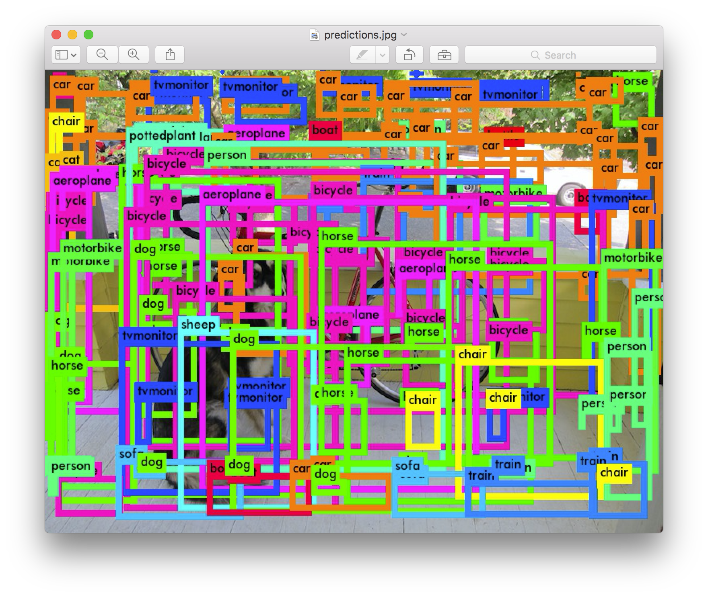
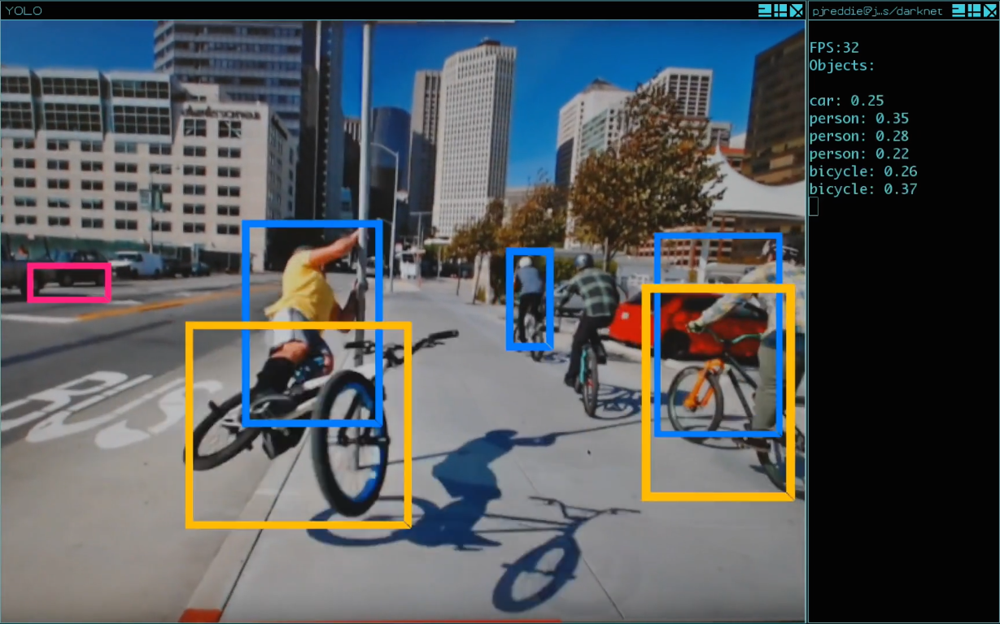

:kr: 다크넷(darknet): C로 작성한 신경망 공개소스  

출처:  
- https://github.com/pjreddie/darknet
- https://pjreddie.com/darknet/yolov1

<a name="욜로v1"></a>
<p align="center"></p>  

## 욜로(YOLO): 실시간 개체 검출(Real-Time Object Detection)

### 갱신: 욜로v2는 종료됨

You might want that instead:  
:kr: https://github.com/zeuseyera/darknet-kr/README.md  
:en: http://pjreddie.com/yolo/

I'm leaving this up just for historical purposes.... or something.
```bash
유튜브 욜로보기 자연 파트2: https://youtu.be/K9a6mGNmhbc
```
You only look once (YOLO) is a system for detecting objects on the Pascal VOC 2012 dataset. It can detect the 20 Pascal object classes:
- person
- bird, cat, cow, dog, horse, sheep
- aeroplane, bicycle, boat, bus, car, motorbike, train
- bottle, chair, dining table, potted plant, sofa, tv/monitor

YOLO is joint work with Santosh, Ross, and Ali, and is described in detail in our paper.

### 1. How It Works

All prior detection systems repurpose classifiers or localizers to perform detection. They apply the model to an image at multiple locations and scales. High scoring regions of the image are considered detections.

We use a totally different approach. We apply a single neural network to the full image. This network divides the image into regions and predicts bounding boxes and probabilities for each region. These bounding boxes are weighted by the predicted probabilities.

<p align="center"></p>  

Finally, we can threshold the detections by some value to only see high scoring detections:

<p align="center"></p>  

Our model has several advantages over classifier-based systems. It looks at the whole image at test time so its predictions are informed by global context in the image. It also makes predictions with a single network evaluation unlike systems like R-CNN which require thousands for a single image. This makes it extremely fast, more than 1000x faster than R-CNN and 100x faster than Fast R-CNN. See our paper for more details on the full system.

### 2. Detection Using A Pre-Trained Model

This post will guide you through detecting objects with the YOLO system using a pre-trained model. If you don't already have Darknet installed, you should do that first.

You already have the config file for YOLO in the cfg/ subdirectory. You will have to download the pre-trained weight file here (753 MB). Or just run this:
```bash
wget http://pjreddie.com/media/files/yolov1.weights
./darknet yolo test cfg/yolov1/yolo.cfg yolov1.weights data/dog.jpg
```

I've included some example images to try in case you need inspiration. Try data/eagle.jpg, data/dog.jpg, data/person.jpg, or data/horses.jpg! Assuming your weight file is in the base directory, you will see something like this:
```bash
./darknet yolo test cfg/yolov1/yolo.cfg yolov1.weights data/dog.jpg
0: Crop Layer: 448 x 448 -> 448 x 448 x 3 image
1: Convolutional Layer: 448 x 448 x 3 image, 64 filters -> 224 x 224 x 64 image
....
27: Connected Layer: 4096 inputs, 1225 outputs
28: Detection Layer
Loading weights from yolo.weights...Done!
data/dog.jpg: Predicted in 8.012962 seconds.
0.941620 car
0.397087 bicycle
0.220952 dog
Not compiled with OpenCV, saving to predictions.png instead
```

Darknet prints out the objects it detected, its confidence, and how long it took to find them. Since we are using Darknet on the CPU it takes around 6-12 seconds per image. If we use the GPU version it would be much faster.

We didn't compile Darknet with OpenCV so it can't display the detections directly. Instead, it saves them in predictions.png. You can open it to see the detected objects:

<p align="center"></p>  

Hooray!!

### 3. Multiple Images

Instead of supplying an image on the command line, you can leave it blank to try multiple images in a row. Instead you will see a prompt when the config and weights are done loading:
./darknet yolo test cfg/yolov1/yolo.cfg yolov1.weights
0: Crop Layer: 448 x 448 -> 448 x 448 x 3 image
1: Convolutional Layer: 448 x 448 x 3 image, 64 filters -> 224 x 224 x 64 image
....
27: Connected Layer: 4096 inputs, 1225 outputs
28: Detection Layer
Loading weights from yolo.weights...Done!
Enter Image Path:


Enter an image path like data/eagle.jpg to have it predict boxes for that image. Once it is done it will prompt you for more paths to try different images. Use Ctrl-C to exit the program once you are done.

### 4. A Tiny Model

The tiny-yolo.cfg is based on the Darknet reference network. You should already have the config file in the cfg/ subdirectory. Download the pretrained weights here (103 MB). Then you can run the model!
```bash
wget http://pjreddie.com/media/files/tiny-yolo.weights
./darknet yolo test cfg/yolov1/tiny-yolo.cfg tiny-yolo.weights data/person.jpg
```

<p align="center"></p>  

The tiny version of YOLO only uses 516 MB of GPU memory and it runs at more than 150 fps on a Titan X. Noticed we changed the detection threshold. This was just so that the bike detection would show up.

### 5. YOLO Model Comparison
•yolo.cfg is based on the extraction network. It processes images at 45 fps, here's the weight files for yolo.cfg trained on 2007 train/val+ 2012 train/val.
•tiny-yolo.cfg is much smaller and based on the Darknet reference network. It processes images at 155 fps, here are weight files for tiny-yolo.cfg trained on 2007 train/val+ 2012 train/val.

### 6. Changing The Detection Threshold

By default, YOLO only displays objects detected with a confidence of .2 or higher. You can change this by passing the -thresh <val> flag to the yolo command. For example, to display all detection you can set the threshold to 0:
./darknet yolo test cfg/yolov1/yolo.cfg yolov1.weights data/dog.jpg -thresh 0


Which produces:
<p align="center"></p>  

### 7. Real-Time Detection On VOC 2012

If you compile Darknet with CUDA then it can process images waaay faster than you can type them in. To efficiently detect objects in multiple images we can use the valid subroutine of yolo.

First we have to get our data and generate some metadata for Darknet. The VOC 2012 test data can be found here but you'll need an account! Once you get the file 2012test.tar you need to run the following commands:
```bash
tar xf 2012test.tar
cp VOCdevkit/VOC2012/ImageSets/Main/test.txt .
sed 's?^?'`pwd`'/VOCdevkit/VOC2012/JPEGImages/?; s?$?.jpg?' test.txt > voc.2012.test
```

These commands extract the data and generate a list of the full paths of the test images. Next, move this list to the darknet/data subdirectory:
```bash
mv voc.2012.test <path-to>/darknet/data
```

Now you are ready to do some detection! Make sure Darknet is compiled with CUDA so you can be super fast. Then run:
```bash
./darknet yolo valid cfg/yolov1/yolo.cfg yolov1.weights
```

You will see a whole bunch of numbers start to fly by. That's how many images you've run detection on! On a Titan X I see this as the final output:
```bash
....
10984
10992
Total Detection Time: 250.000000 Seconds
```

There are 10,991 images in the VOC 2012 test set. We just processed them in 250 seconds! That's 44 frames per second! If you were using Selective Search it would take you 6 hours to even extract region proposals for all of the images. We just ran a full detection pipeline in 4 minutes. Pretty cool.

The predicted detections are in the results/ subdirectory. They are in the format specified for Pascal VOC submission.

If you are interested in reproducing our numbers on the Pascal challenge you should use this weight file (1.0 GB) instead. It was trained with the IOU prediction we describe in the paper which gives slightly better mAP scores. The numbers won't match exactly since I accidentally deleted the original weight file but they will be approximately the same.

### 8. Real-Time Detection on a Webcam

Running YOLO on test data isn't very interesting if you can't see the result. Instead of running it on a bunch of images let's run it on the input from a webcam! Here is an example of YOLO running on a webcam that we then pointed at YouTube videos:
```bash
유튜브 욜로보기 파트2: https://youtu.be/r6ZzopHEO1U
```
 
To run this demo you will need to compile Darknet with CUDA and OpenCV. You will also need to pick a YOLO config file and have the appropriate weights file. Then run the command:
```bash
./darknet yolo demo cfg/yolov1/yolo.cfg yolov1.weights
```

YOLO will display the current FPS and predicted classes as well as the image with bounding boxes drawn on top of it.

<p align="center"></p>  

You will need a webcam connected to the computer that OpenCV can connect to or it won't work. If you have multiple webcams connected and want to select which one to use you can pass the flag -c <num> to pick (OpenCV uses webcam 0 by default).

### 9. YOLO + COCO

COCO is a large detection dataset from Microsoft with 80 object categories. We have a couple YOLO models trained on COCO. If you are starting from scratch you can run these commands to detect objects in an image:
```bash
git clone https://github.com/pjreddie/darknet
cd darknet
make
wget http://pjreddie.com/media/files/tiny-coco.weights
./darknet coco test cfg/yolov1/tiny-coco.cfg tiny-coco.weights data/giraffe.jpg
```

To view the detections, check the file predictions.png.

<p align="center"></p>  

You can also use the full YOLO model:
```bash
wget http://pjreddie.com/media/files/yolo-coco.weights
./darknet coco test cfg/yolov1/yolo-coco.cfg yolo-coco.weights data/giraffe.jpg
```

### 10. Training YOLO

You can train YOLO from scratch if you want to play with different training regimes, hyper-parameters, or datasets. Here's how to get it working on the Pascal VOC dataset.

### 11. Get The Pascal VOC Data

To train YOLO you will need all of the VOC data from 2007 to 2012. You can find links to the data here. To get all the data, make a directory to store it all and from that directory run:
```bash
wget https://pjreddie.com/media/files/VOCtrainval_11-May-2012.tar
wget https://pjreddie.com/media/files/VOCtrainval_06-Nov-2007.tar
wget https://pjreddie.com/media/files/VOCtest_06-Nov-2007.tar
tar xf VOCtrainval_11-May-2012.tar
tar xf VOCtrainval_06-Nov-2007.tar
tar xf VOCtest_06-Nov-2007.tar
```

There will now be a VOCdevkit/ subdirectory with all the VOC training data in it. 

### 12. Generate Labels for VOC

Now we need to generate the label files that Darknet uses. Darknet wants a .txt file for each image with a line for each ground truth object in the image that looks like:
```bash
<object-class> <x> <y> <width> <height>
```

Where x, y, width, and height are relative to the image's width and height. To generate these file we will run the voc_label.py script in Darknet's scripts/ directory. Let's just download it again because we are lazy.
```bash
wget https://pjreddie.com/media/files/voc_label.py
python voc_label.py
```

After a few minutes, this script will generate all of the requisite files. Mostly it generates a lot of label files in VOCdevkit/VOC2007/labels/ and VOCdevkit/VOC2012/labels/. In your directory you should see:
```bash
ls
2007_test.txt   VOCdevkit
2007_train.txt  voc_label.py
2007_val.txt    VOCtest_06-Nov-2007.tar
2012_train.txt  VOCtrainval_06-Nov-2007.tar
2012_val.txt    VOCtrainval_11-May-2012.tar
```

The text files like 2007_train.txt list the image files for that year and image set. Darknet needs one text file with all of the images you want to train on. In this example, let's train with everything except the validation set from 2012 so that we can test our model. Run:
```bash
cat 2007_* 2012_train.txt > train.txt
```

Now we have all the 2007 images and the 2012 train set in one big list. That's all we have to do for data setup!

### 13. Point Darknet to Pascal Data

Now go to your Darknet directory. We will have to change the train subroutine of yolo to point it to your copy of the VOC data. Edit src/yolo.c, lines 18 and 19:
```bash
18     char *train_images = "/home/pjreddie/data/voc/test/train.txt";
19     char *backup_directory = "/home/pjreddie/backup/";
```

train_images should point to the train.txt file you just generated and backup_directory should point to a directory where you want to store backup weights files during training. Once you have edited the lines, re-make Darknet.

### 14. Download Pretrained Convolutional Weights

For training we use convolutional weights that are pre-trained on Imagenet. We use weights from the Extraction model. You can just download the weights for the convolutional layers here (86 MB).

If you want to train the tiny model you should use the darknet reference network convolutional weights here (25 MB).

If you want to generate the pre-trained weights yourself, download the pretrained Extraction model and run the following command:
```bash
./darknet partial cfg/extraction.cfg extraction.weights extraction.conv.weights 24
```

But if you just download the weights file it's way easier.

### 15. Train!!

You are finally ready to start training. Run:
```bash
./darknet yolo train cfg/yolov1/yolo.train.cfg extraction.conv.weights
```

It should start spitting out numbers and stuff.

### 16. Training Checkpoints

After every 128,000 images Darknet will save a training checkpoint to the directory you specified in src/yolo.c. These will be titled something like yolo_12000.weights. You can use them to restart training instead of starting from scratch.

After 40,000 iterations (batches) Darknet will save the final model weights as yolo_final.weights. Then you are done!

Good luck!!


